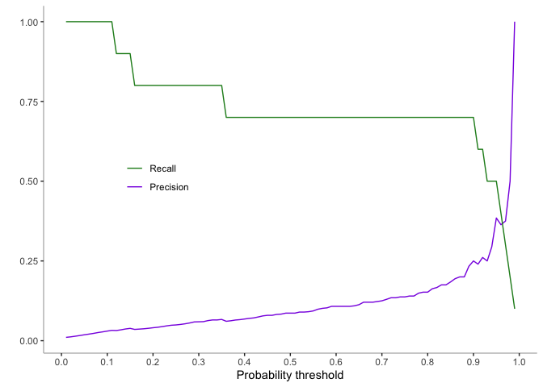
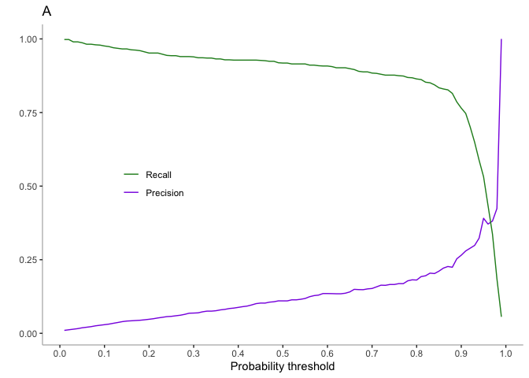
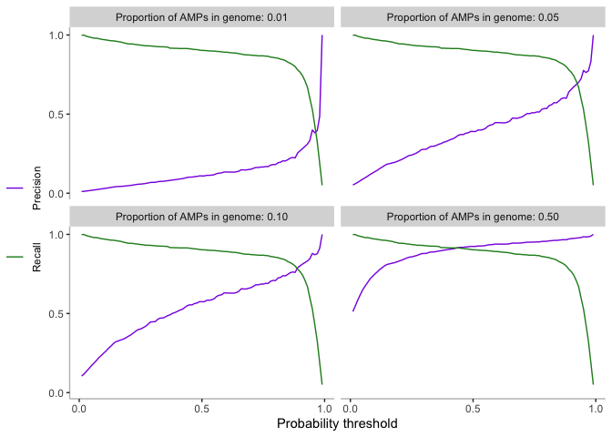
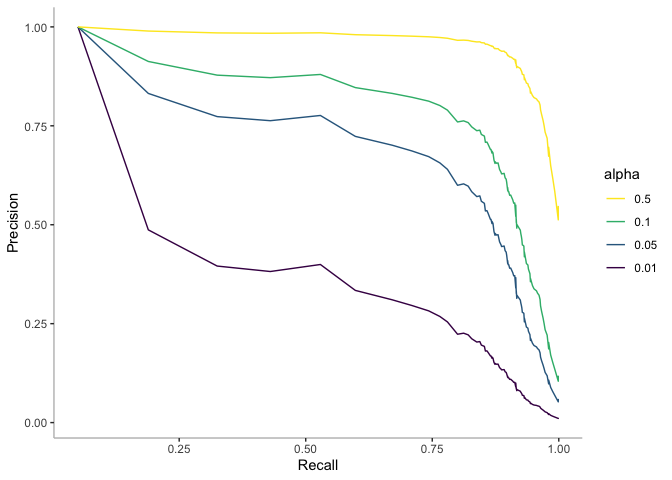
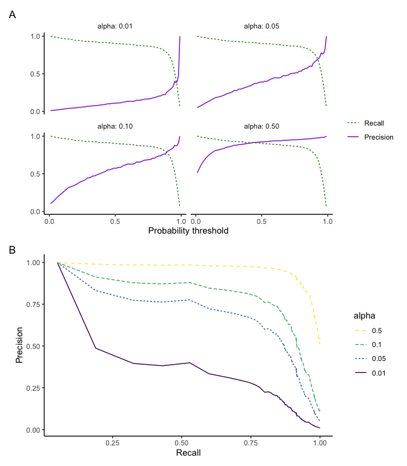

Precision recall for AMP proportions in a genome
================

-   [1 Initial look at the precision and recall curves for a low AMP
    proportion](#initial-look-at-the-precision-and-recall-curves-for-a-low-amp-proportion)
    -   [1.0.1 Plot](#plot)
-   [2 Average precision and recall curves for a low AMP
    proportion](#average-precision-and-recall-curves-for-a-low-amp-proportion)
    -   [2.0.1 Plot](#plot-1)
-   [3 Theoretical AMP proportion in a genome -
    alpha](#theoretical-amp-proportion-in-a-genome---alpha)
    -   [3.1 alpha equation and
        implementation](#alpha-equation-and-implementation)
        -   [3.1.1 Plot](#plot-2)
    -   [3.2 Traditional precision-recall
        curve](#traditional-precision-recall-curve)
        -   [3.2.1 Plot](#plot-3)
    -   [3.3 Comparing the theoretical 0.01 alpha value with the
        averaged 0.01 AMP proportion from a real test
        set](#comparing-the-theoretical-0.01-alpha-value-with-the-averaged-0.01-amp-proportion-from-a-real-test-set)
        -   [3.3.1 Plot](#plot-4)

To start, we read in ampir’s v\_0.1 trained model as well as the test
dataset

``` r
ampir_v0.1 <- readRDS("data/ampir_0.1.0_data/svm_Radial98_final.rds")
features98Test <- readRDS("data/ampir_0.1.0_data//features98TestNov19.rds")
```

We then use the ampir model to predict the proteins in the test set. We
then add the actual cases to the prediction outcome.

``` r
test_pred_prob <- predict(ampir_v0.1, features98Test, type = "prob")

ampir_prob_data <- test_pred_prob %>%
  add_column(Label = features98Test$Label) %>%
  rename(Neg = Bg) %>%
  rename(prob_AMP = Tg) %>%
  mutate(Label = ifelse(Label == "Tg", "Pos", "Neg"))
```

# 1 Initial look at the precision and recall curves for a low AMP proportion

To create an idea what to set the probability threshold to for AMP
prediction in genomes, the precision and recall (AKA sensitivity) curves
plot over a range of probability values was constructed using a dataset
where AMPs only comprise approximately 1% (10/996).\`

First a random 10 true AMPs from the predicted proteins in the ampir
v0.1 test set, plus all the true background proteins, were isolated.

``` r
ampir_prob_data_bg <- ampir_prob_data[grep("Neg", ampir_prob_data$Label),]

ampir_prob_data_tg_10 <- ampir_prob_data[sample(grep("Pos", ampir_prob_data$Label), 10),]

ampir_prob_data_bg_tg10 <- rbind(ampir_prob_data_tg_10, ampir_prob_data_bg)
```

The function `calc_cm_metrics` was then used to calculate a confusion
matrix and some associated performance metrics over a range of predicted
probability values. The original output of the function is a vector. To
use multiple probability threshold, `map_df` is used for iteration and
to convert the output to a dataframe. It is then converted to a long
format focusing on the precision and recall columns using `pivot_longer`
(previously `gather`)

``` r
pr_curve_sample <- map_df(seq(0.01, 0.99, 0.01), calc_cm_metrics, ampir_prob_data_bg_tg10)

pr_curve_sample_long <- pivot_longer(pr_curve_sample, cols = c("Precision", "Recall"), names_to = "metric", values_to = "value")
```

### 1.0.1 Plot

<!-- -->

**Figure 1.1:** The precision and recall curves over a range of
probability thresholds for an AMP proportion of 0.01 within the ampir
v.0.1 test set

0.01 is a very small proportion and the curves are creating “big steps”.
To smoothen out the curves, 100 random selection of 1% (10 AMPs) were
used to average the curves.

# 2 Average precision and recall curves for a low AMP proportion

First `replicate` and `slice_sample` were used to select 10 random AMPs
100 times which were bound together in a table with `rbind`.

``` r
ampir_prob_data_tg <- filter(ampir_prob_data, Label == "Pos")


samples_list <- replicate(n = 100, ampir_prob_data_tg %>% 
                             slice_sample(n=10) %>% 
                             rbind(ampir_prob_data_bg), simplify = F)
```

Then a nested loop was required to use `calc_cm_metrics` with a range of
probability thresholds over the 100 dataframe samples

``` r
samples_list_metrics <- lapply(seq_along(samples_list), function(i) {
                               map_df(seq(0.01, 0.99, 0.01),
                                        calc_cm_metrics, 
                                        samples_list[[i]])})
```

Now I have a list with 100 dataframes in it that each contain metrics
calculated with `calc_cm_metrics` from 100 dataframes that each contain
10 random AMPs and 996 background proteins.

I want to average the precision and recall columns over the 0.01 - 0.99
p\_threshold range. To do this I bind all the dataframes in the list
together into one big dataframe using`bind_rows`. Then I use the
`group_by` function to group the samples by the p\_threshold and then
use `summarise` to create two new columns that contain the calculated
average of precision and recall and finally convert it into long format
again.

``` r
samples_metrics <- bind_rows(samples_list_metrics, .id = "sample")

samples_metrics_averages <- samples_metrics %>% 
                group_by(p_threshold) %>% 
                summarise(Precision_average = mean(Precision), 
                          Recall_average = mean(Recall)) %>%
                pivot_longer(cols = c("Precision_average", "Recall_average"),
                               names_to = "metric",
                               values_to = "value") %>%
                mutate(value = coalesce(value, 1)) #replace 0.99 prob NaN value with 1
```

### 2.0.1 Plot

<!-- -->

**Figure 1.2:** The precision and recall curves over a range of
probability thresholds for an average AMP proportion of 0.01 within the
ampir v.0.1 test set

# 3 Theoretical AMP proportion in a genome - alpha

A new variable,
, was
introduced to represent the percentage of AMPs in the test set to more
easily create precision-recall curves for various AMP proportions.

## 3.1 alpha equation and implementation

The calculation for the recall metric for

remains the same but the precision metric has been slightly modified
(see below):

}")


Function that uses the recall-precision metric calculations for any
 value

``` r
calc_precision_recall <- function(df,alpha) {
  df %>% 
  mutate(Recall = Recall) %>% 
  mutate(Precision = TP*alpha / (TP*alpha+FP*(1-alpha))) %>% 
  select(Recall,Precision,p_threshold)
}
```

Calculate metrics from real predicted data

``` r
ampir_roc_data <- map_df(seq(0.01, 0.99, 0.01), calc_cm_metrics, ampir_prob_data)
```

Use the function for a range of

values and collapse to data frame

``` r
pr_data <- do.call(rbind,lapply(c(0.01,0.05,0.1,0.5),function(alpha) {
  calc_precision_recall(ampir_roc_data,alpha) %>% add_column(alpha=alpha)
}))
```

### 3.1.1 Plot

Plot an explicit axis for `p_threshold` using four different

values. This is useful for choosing the threshold value. It shows that
as 
gets smaller and smaller the Precision curve shifts so that high values
of precision are only achieved for very high `p_threshold` values.

<!-- -->

**Figure 1.2:** The precision and recall curves over a range of
probability thresholds for four different proportion of AMPs in a
genome.

## 3.2 Traditional precision-recall curve

Using a traditional precision-recall curve is useful in the sense that
it very clearly shows the tradeoff between the two. A useful way to
think of Precision is that it defines the “Purity” of our predicted set
of AMPs whereas the Sensitivity or Recall defines the “Completeness” of
the predicted AMP set. We want to choose the p\_threshold so that there
is a balance or Purity and Completeness. When
 is
high this is easy to do, but when it is low it becomes a very difficult
tradeoff.

### 3.2.1 Plot

<!-- -->

**Figure 1.3:** A traditional precision-recall curve depicting various
alpha values that represent different proportions of AMPs in a genome

## 3.3 Comparing the theoretical 0.01 alpha value with the averaged 0.01 AMP proportion from a real test set

Extract 1% alpha value

``` r
pr_data_alpha1_long <- pr_data_long %>% filter(alpha == 0.01)
```

### 3.3.1 Plot

The precision recall curves plot for
 =
0.01 is extremely similar to the average curve of 0.01 AMPs in the ampir
v0.1 test set. This was as expected and shows the

variable is a valid depiction as the proportion of AMPs in a test set.

<!-- -->

**Figure 1.4:** The precision and recall curves over a range of
probability thresholds for A: an average AMP proportion of 0.01 within
the ampir v.0.1 test set and B: for alpha, a theoretical proportion of
AMPs within a genome, equal to 0.01.
