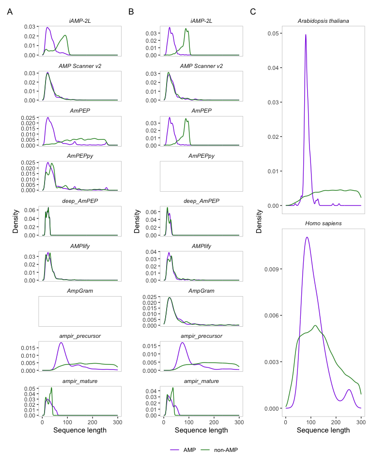

Training datasets used for AMP prediction
================

# Introduction

The effectiveness of supervised learning methods for predictive modeling
depends on the degree to which the training data is a good match for the
query data for which prediction is sought. For antimicrobial peptide
(AMP) prediction, training typically occurs on a dataset composed of
sequences with known antimicrobial activity (positive AMPs) and a
background or negative set comprised of sequences that presumably do not
have antimicrobial activity (non-AMPs). In this document we will explore
the composition of both positive and negative datasets used by AMP
predictors. We find that although there is much overlap in their use of
positive AMPs there are substantial differences in (a) the use of
precursor vs mature peptides, (b) the extent to which positive and
negative data have length-matched distributions, and (c) the ratio of
positive and negative cases (balance).

Our focus is on the use of AMP predictors as part of an ’omics-based
novel AMP discovery workflow. In this context the input/query data is
usually the complete set of predicted proteins for an organism, which
might be derived from translations of gene models or from translated
transcriptome sequences. Here we refer to such a dataset as a proteome.

# Reference proteomes

As representative examples of the type of data that would be used as
input in ’omics scanning applications we used the complete proteome sets
of *Arabidopsis thaliana* (a plant) and *Homo sapiens* (human). Both
organisms have been intensively studied and as a consequence, their
reference proteomes are likely to include sequences for the vast
majority of protein-coding genes. Functional information for the
proteins, including AMPs in these species is among the most complete
available, but even for these organisms it is highly likely that some
known AMPs have not been identified. Our assumption here is that these
proteomes are completely classified for AMP activity (i.e. every AMP
correctly identified).

# AMP predictor data

The training and test sets of nine AMP predictors (**Table 1.1**) were
examined to assess the degree to which they varied between predictors,
and how well they matched the proteomes of *Arabidopsis thaliana* and
*Homo sapiens*.

**Table 1.1:** Summary table of the number of positive and negative
sequences present in the training and test set in six AMP predictors

| AMP predictor      | Train - AMPs | Train - non-AMPs | Test - AMPs | Test - non-AMPs |
|:-------------------|:------------:|:----------------:|:-----------:|:---------------:|
| iAMP-2L            |     897      |      2,405       |     920     |       920       |
| amPEP              |    3,268     |     166,791      |    *NS*     |      *NS*       |
| Deep-ampEP30       |    1,529     |      1,529       |     94      |       94        |
| amPEPpy            |    3,268     |      3,268       |    *NS*     |      *NS*       |
| AMP Scanner v2     |    1,066     |      1,066       |     712     |       712       |
| AMPlify            |    3,338     |      3,338       |     835     |       835       |
| AmpGram            |    2,216     |      2,216       |     247     |       247       |
| ampir_precursor v1 |    1,187     |      11,864      |     296     |      2,966      |
| ampir_mature v1    |    2,586     |      2,657       |     646     |       664       |

\*NS: not specified

**Table 1.2:** AMP Predictors with their publications and accessibility

| AMP predictor name | Reference                                                                                                         | Availability                                                                          |
|--------------------|-------------------------------------------------------------------------------------------------------------------|---------------------------------------------------------------------------------------|
| amPEP              | [Bhadra et al. 2018](https://doi.org/10.1038/s41598-018-19752-w)                                                  | [MATLAB source code](https://sourceforge.net/projects/axpep/files/AmPEP_MATLAB_code/) |
| Deep-amPEP30       | [Yan et al. 2020](https://doi.org/10.1016/j.omtn.2020.05.006)                                                     | [Web Server](https://cbbio.online/AxPEP/)                                             |
| amPEPpy            | [Lawrence et al 2020](http://dx.doi.org/10.1093/bioinformatics/btaa917)                                           | [Python script](https://github.com/tlawrence3/amPEPpy)                                |
| AMP scanner v2     | [Veltri et al. 2018](https://doi.org/10.1093/bioinformatics/bty179)                                               | [amp scanner webserver](https://www.dveltri.com/ascan/v2/ascan.html)                  |
| AMPlify            | [Li et al. 2020](https://www.biorxiv.org/content/10.1101/2020.06.16.155705v1.full)                                | [Github repository](https://github.com/bcgsc/AMPlify)                                 |
| AmpGram            | [Burdukiewicz et al 2020](https://www.ncbi.nlm.nih.gov/pmc/articles/PMC7352166/)                                  | [Github repository](https://github.com/michbur/AmpGram)                               |
| ampir              | [Fingerhut et al 2020](https://academic.oup.com/bioinformatics/article-lookup/doi/10.1093/bioinformatics/btaa653) | [Github repository](https://github.com/legana/ampir)                                  |

**iAMP-2L Data**

The benchmark data provided by [Xiao et
al. 2013](https://doi.org/10.1016/j.ab.2013.01.019) used for
[iAMP-2L](http://www.jci-bioinfo.cn/iAMP/data.html) has been used in
several studies to provide a somewhat independent estimate of prediction
accuracy. Their training data, or benchmark dataset as they termed it,
comprises 897 AMPs and 2,405 non-AMPs. Their test or independent dataset
comprises of 920 AMPs and 920 non-AMPs.

**AmPEP Training Data**

The AmPEP 2018 AMP predictor provides its training data available
directly for download from
<https://cbbio.cis.um.edu.mo/software/AmPEP/>. The final training
dataset used by amPEP is a large dataset of 166,791 non-AMP sequences
and 3,268 AMPs. amPEP used the Xiao et al. 2013 dataset from the iAMP-2L
predictor as a test set (see above).

AmPEP was redesigned in 2020 as Deep-AmPEP30 to focus on short AMPs ( \<
30 amino acids) by [Yan et
al](https://doi.org/10.1016/j.omtn.2020.05.006) and its training and
test data is available
[here](https://cbbio.online/AxPEP/?action=dataset). Deep-AmPEP30’s
training set consists of 1,529 AMPs and non-AMPs and their test set
consists of 94 AMPs and non-AMPs.

AmPEP was additionally created as a python application, amPEPpy, by
[Lawrence et al. 2020](https://doi.org/10.1093/bioinformatics/btaa917).
amPEPpy’s training data originated from amPEP but were modified to
ensure that positive and negative sets had the same length distribution.
The data were obtained via amPEPpy’s [GitHub
page](https://github.com/tlawrence3/amPEPpy). No specific test data were
used for this predictor. The authors used OOB error to calculate
elements of the confusion matrix meaning that the composition of test
data was effectively identical to the training set.

**AMP Scanner v2 Data**

AMP Scanner ([Veltri et
al. 2018](https://doi.org/10.1093/bioinformatics/bty179%5D)) data used
for training, testing and evaluation are available directly for download
from <https://www.dveltri.com/ascan/v2/about.html>. AMP Scanner’s
training data consisted of 1,066 AMP and non-AMP sequences. Their
testing data consisted of 712 AMP and non-AMP sequences.

**AMPlify data**

AMPlify used multiple attention mechanisms and ensemble deep learning to
create an AMP prediction model ([Li et
al. 2020](https://doi.org/10.1101/2020.06.16.155705)). Similar to most
AMP predictors, a proportion of their AMP dataset originated from the
general [Antimicrobial Peptide Database](http://aps.unmc.edu/AP).
However, they also used the [Database of Anuran Defense
Peptides](http://split4.pmfst.hr/dadp/0) which focuses on AMPs from
frogs and toads. Their negative dataset originated from Swiss-Prot and,
like most AMP predictors, they excluded any proteins that had
annotations which referred to potential antimicrobial activity. However,
like ampir, they retain the secreted proteins. Their data is available
from the [AMPlify’s software GitHub
page](https://github.com/bcgsc/AMPlify). Their training set consists of
3,338 AMPs and 3,338 non-AMPs and their test set consists of 835 AMPs
and 835 non-AMPs.

**AmpGram data**

AmpGram was created in 2020 and in addition to the standard AMPs, it
also focuses on predicting longer proteins that contain antimicrobial
activity, such as the milk protein, lactoferrin, and on non-AMP proteins
which produce antimicrobial proteolysis products, such as human
thrombin. AmpGram uses amino acid motifs and the random forest model to
classify AMPs [Burdukiewicz et
al. 2020](https://doi.org/10.3390/ijms21124310). AmpGram’s analysis
details and data can be obtained from [AmpGram’s analysis
repository](https://github.com/michbur/AmpGram-analysis). Their training
data is not specified as a file but their benchmark data can be found in
the `benchmark.fasta` file. This test set contains 247 AMP and non-AMP
sequences. AmpGram also used the dataset from [Gabere and Noble
2017](https://doi.org/10.1093/bioinformatics/btx081) which used AMPs
from the [DAMPD](https://dx.doi.org/10.1093%2Fnar%2Fgkr1063) and
[APD3](https://doi.org/10.1093/nar/gkv1278) AMP databases and non-AMPs
from UniProt.

**ampir**

ampir was divided in two different models, precursor, which focuses on
longer sequences (between 60-300) and mature, which only contains short
sequences (between 10-50)

First we compare the test and training data of each predictor. For all
predictors other than AmPEP the length distributions of test and
training were almost identical reflecting the fact the in most cases the
test set was a randomly held-back portion of the same data used to
generate the training set. AmPEP is the exception to this and has a
different distribution for the test data, this being derived from the
Xiao et al benchmark set.

<!-- -->

**Figure 1.1:** Comparison of sequence length distributions for positive
(AMP; purple) and negative (non-AMP; green) fractions in training (A)
and test data (B) of nine AMP predictors, and for the proteomes of *A.
thaliana* and *H. sapiens* (C).

# Overlap in positive AMP data between predictors

There are several databases that list AMPs with confirmed activity,
including [APD 3](http://aps.unmc.edu/AP/), [DRAMP
2.0](http://dramp.cpu-bioinfor.org/),
[dbAMP](http://140.138.77.240/~dbamp/index.php) and
[UniProt](https://www.uniprot.org/uniprot/?query=keyword%3A%22Antimicrobial+%5BKW-0929%5D%22&sort=score)
and most predictors use one or more of these as the basis for
constructing their positive AMP dataset.

Here we explore the degree of overlap between AMP predictor positive
training data that exists as a result of these shared origins, and how
this interacts with the length distribution of AMPs and degree to which
mature peptides vs precursor proteins are included.

To examine sequence overlap between databases we used the stringdist
package to calculate the [Jaro
distance](https://en.wikipedia.org/wiki/Jaro–Winkler_distance) between
all pairs of positive AMP sequences across all predictor training/test
datasets as well as reference proteomes for Arabidopsis and Human. The
Jaro distance was chosen because it is normalised for the length of both
sequences and produces a value between 0 (exact match) and 1 (completely
dissimilar). Highly similar sequences (Jaro distance \<0.2) were
considered to be the same as these are likely strong homologs and manual
inspection revealed that in many cases these matches occurred between
mostly identical sequences with minor differences, likely due to
reporting conventions and/or minor discrepancies between databases.

<!-- -->

**Figure 1.3:** UpSet plot showing overlap between positive training
data used for eight AMP predictors, and known AMPs within the reference
proteomes of *Arabidopsis thaliana* and *Homo sapiens*.

The UpSet plot shown highlights some key patterns of overlap between
datasets and how this relates to their length and precursor protein
status (indicated by signal peptide). One key trend is the high degree
of uniqueness of sequences used by `ampir` (first and second bars). Also
note that there are several large groups of AMPs shared by many
predictors (columns 3 and 4) which appear to be almost exclusively
comprised of mature sequences (red bars, short length distributions).
These mature peptides comprise only a very small fraction of the A.
thaliana and H. sapiens proteomes.

# Typical Sequence Structure of AMP Precursor Proteins

As shown in Figures 1.2 and 1.3 there is a significant divide between
the composition of AMP predictor training sets based on the length
distribution of included sequences. This is significant because many
AMPs are first secreted as a longer precursor sequence that then
undergoes cleavage to produce a mature (shorter) peptide. Some databases
only list this shorter peptide sequence as it is the active peptide,
however, when working with raw proteome input data the sequences given
will be translated coding sequences from gene models and therefore
correspond to the precursor sequence with no reliable way to accurately
deduce the mature sequence. A survey of precursor sequences for AMPs
listed in Uniprot can be used to reveal the typical sequence structure
of precursors. Here we take advantage of the fact that for many well
characterised AMPs in SwissProt the positions of the signal peptide,
mature peptide and c-terminal sequence are given.

<!-- -->

**Figure 1.4:** Sequence composition of 831 AMP sequences with length \>
50 (likely precursors) in SwissProt showing the relative locations of
Signal Peptide, Mature AMP and C-terminal sequences.
