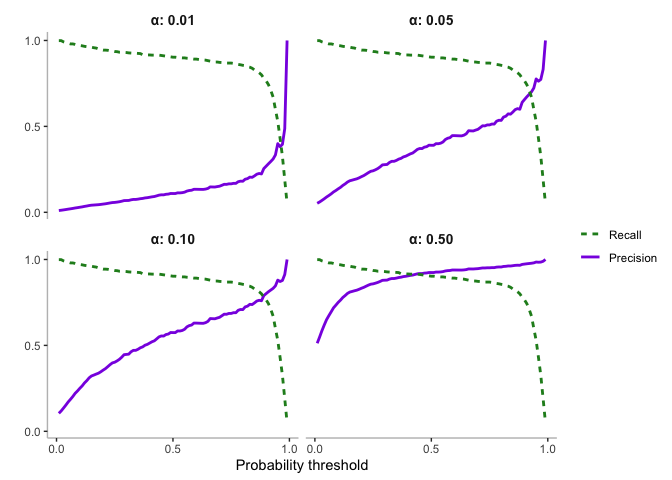

Performance Metrics in an ’Omics-Scanning Context
================

# Background

There are many metrics that are typically reported when evaluating the
performance of machine learning based AMP prediction methods (see for
example (Xu et al. 2021) ). At their core, all of these metrics are
based on the four quantities that make up the “confusion matrix,” and
which represent modes of successful classification (TN, TP) and modes of
failure (FP, FN):

| mode      | AMPs (+tve) | non-AMP (-ve) |
|-----------|-------------|---------------|
| Correct   | TP          | TN            |
| Incorrect | FP          | FN            |

Where the abbreviations are as follows:

-   TP: True Positives
-   TN: True Negatives
-   FP: False Positives
-   FN: False Negatives

Typical metrics calculated from these four elements include Sn
(Sensitivity), Sp (Specificity), Pr (Precision), Acc (Accuracy), MCC
(Mathews Correlation Coefficient) with formulae for calculation as
follows:

(TP+FN)(TN+FP)(TN+FN)}}
")

When reporting performance of a new predictor, or performing a methods
review it is common to report some or all of these measures. In such
cases a single value per metric per predictor is typically reported,
however, it is important to recognise that for a given predictor the
values of the confusion matrix and associated performance metrics will
depend on two additional key factors;

1.  The classification threshold,
    . Usually the
    probability calculated by the model that a sequence is an AMP
2.  The balance of the test dataset,
    .
    This is the proportion of true AMP sequences in the data.

There is a strong convention (adhered to in almost all papers) that
these two values should be set as
()
when calculating the single valued metrics mentioned above. Another
class of metrics measures the area under a curve, generated by varying
the value of  from 0
through to 1. While these metrics (AUPRC, AUROC) do not explicitly
choose 
they still attempt to reduce performance of the predictor to a single
value across the range of
, placing equal emphasis
on all parts of this range.

In this section we show that these conventions on benchmarking are a
poor fit for ’omics scanning applications, where two key considations
come into play:

1.  The value of
    
    is typically very small (ie AMPs are a minority class, typically on
    the order of 1% of sequences in the input).
2.  Obtaining a high value for precision
     is important,
    and in order to achieve this it is often necessary to work in a
    regime where  is
    much higher than 0.5

# Effect of alpha on precision and recall curves

We begin by exploring how the two key characteristics of ’omics-scanning
(low 
and desire for high precision) interact. To do this we explore how
precision-recall curves change as a function of
.

First consider how the confusion matrix scales with
. This
can be calculated by recognising that both TP and FN are actually AMPs
and therefore scale with
,
whereas TN and FP are actually non-AMP and will therefore scale with
").
Given a set of confusion matrix values generated with a balanced test
set
()
corresponding values for a different
 can
be calculated as follows:

 \\
FP_{\alpha} = FP_{0.5}  (1-\alpha) \\
FN_{\alpha} = FN_{0.5}  \alpha 
")

By extension the precision and recall can therefore be calculated as:

} \\
Re_{\alpha} = \frac{TP \alpha}{TP \alpha + FN \alpha} = \frac{TP}{TP  + FN }
")

Note here that Recall,
 is unaffected by

whereas precision will decrease as

decreases. Importantly, this effect on precision is stronger the higher
the false positive rate. As a consequence of this, an ’omics-scanning
application that desires high precision will most likely need to adjust
the threshold probability,
 to reduce false
positives.

To see how this works in practice consider the variation in precision
and recall curves for ampir as a function of
.
These are plotted in Figure 2.1 and shows that as
 gets
smaller and smaller the precision curve shifts so that high values are
only achieved for very high `p_threshold` values.

<!-- -->

**Figure 2.1:** The precision and recall curves for four different
values of
.

Another way to look at the effect of alpha on precision and recall is to
plot one against the other in a so called precision-recall curve. In
these curves the probability threshold does not appear explicitly but
still controls the variation in precision and recall across their range
of values. A useful way to think of precision is that it defines the
“purity” of our predicted set of AMPs whereas the sensitivity or recall
defines the “completeness” of the predicted AMP set. This shows that at

it is possible to maintain high precision even at relatively high values
of recall but this is not the case as

decreases. At values of
 that
are realistic for ’omics-scanning (\~1%) it is necessary to choose
between precision or recall as it is no longer possible to achieve high
values for both.

<!-- -->

**Figure 2.2:** A precision-recall curve depicting various alpha values
that represent different proportions of AMPs in a genome

# Effect of alpha on ROC curves

Previous work has highlighted the fact that with unbalanced data, ROC
curves are less informative of algorithm performance compared with
precision-recall curves (Davis and Goadrich 2006). This can easily be
seen by considering the two axes in a ROC curve (y=TPR,x=FPR), and the
way that these scale with
. The
equations below clearly show that neither the x or y axes of a ROC curve
are affected by changes in
 which
implies that both ROC curves themselves and associated metrics (AUROC)
are completely invariant with the dataset balance. In some situations
this may be desirable, however, for omics-scanning where there is a
strong requirement for high precision (which does vary with
)
ROC-based metrics can provide a misleading estimate of performance.

FP}{(1-\alpha)FP + (1-\alpha)TN} = FPR = ROC_{x}
")

# Supplementary: Empirical test that the formulae for alpha scaling of the confusion matrix are correct

Here we perform a simple check to ensure that the formulae shown above
for scaling of precision and recall under different values of alpha are
correct. We do this by randomly subsampling the raw outputs from ampir
to produce a dataset with a specified proportion of true AMPs (ie a
specified
).

This random subsample (with
)
is then used to calculate a confusion matrix over a range of probability
thresholds as done above for
.
Since the total number of AMPs in this random subsample is very small it
is necessary to take the average across many such random subsamples to
obtain a smooth curve representative of the original (larger) dataset.
The precision and recall curves obtained via this bootstrapping process
appear almost identical to those obtained using the theoretical scaling.

<!-- -->

**Figure 2.3:** The precision and recall curves over a range of
probability thresholds for

**A:** Obtained empirically via bootstrapping: and **B:** obtained using
theoretical scaling of the confusion matrix.

Davis, Jesse, and Mark Goadrich. 2006. “The Relationship Between
Precision-Recall and ROC Curves.” In *Proceedings of the 23rd
International Conference on Machine Learning*, 233–40. ICML ’06. New
York, NY, USA: Association for Computing Machinery.

Xu, Jing, Fuyi Li, André Leier, Dongxu Xiang, Hsin-Hui Shen, Tatiana T
Marquez Lago, Jian Li, Dong-Jun Yu, and Jiangning Song. 2021.
“Comprehensive Assessment of Machine Learning-Based Methods for
Predicting Antimicrobial Peptides.” *Brief. Bioinform.*, March.

