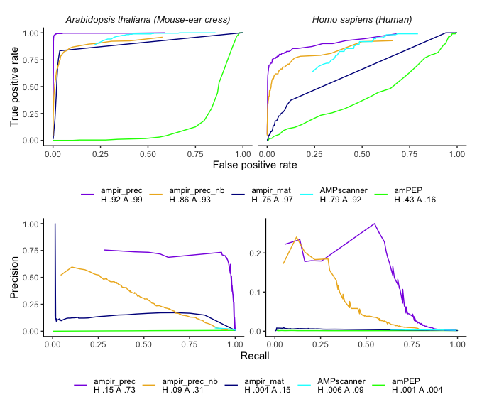

Benchmarking predictors
================

The reference proteomes for the organisms *Homo sapiens* (human),
proteome ID: up000005640, and *Arabidopsis thaliana* (mouse-ear cress),
proteome ID: up000006548, were downloaded from UniProt proteomes
(accessed 23 Jan 2021). *H. sapiens* contained 20,379 reviewed proteins
and 55,398 unreviewed proteins. *A. thaliana* contained 15,956 reviewed
and 23,390 unreviewed proteins.

``` r
human_proteome <- read_tsv("data/proteomes/uniprot-proteome UP000005640.tab") %>% mutate(Label = case_when(str_detect(`Keyword ID`, "KW-0929") ~ "Pos", TRUE ~ "Neg"))
cress_proteome <- read_tsv("data/proteomes/uniprot-proteome UP000006548.tab") %>% mutate(Label = case_when(str_detect(`Keyword ID`, "KW-0929") ~ "Pos", TRUE ~ "Neg"))

reference_proteomes <- rbind(human_proteome, cress_proteome)
```

## ampir

``` r
cress_pred_ampir_prec <- cress_proteome %>% select(`Entry name`, Sequence) %>% as.data.frame() %>% predict_amps(n_cores = 3) %>% add_column(Model = "ampir_precursor")

cress_pred_ampir_mat <- cress_proteome %>% select(`Entry name`, Sequence) %>% as.data.frame() %>% predict_amps(n_cores = 3, model = "mature")%>% add_column(Model = "ampir_mature")

human_pred_ampir_prec <- human_proteome %>% select(`Entry name`, Sequence) %>% as.data.frame() %>% predict_amps(n_cores = 3) %>% add_column(Model = "ampir_precursor")

human_pred_ampir_mat <- human_proteome %>% select(`Entry name`, Sequence) %>% as.data.frame() %>% predict_amps(n_cores = 3, model = "mature")  %>% add_column(Model = "ampir_mature")
```

In addition to ampir’s standard models (`ampir_precursor` and
`ampir_mature`), a special model was trained with sequences present in
the `ampir_precursor` model, **minus** any *H. sapiens* or *A. thaliana*
proteins (see ampir’s analysis repository,
[AMP\_pub](https://github.com/Legana/AMP_pub), workflow
02\_build\_training\_data for details). This was done to remove any
potential biases when testing the trained models on the *H. sapiens* and
*A. thaliana* proteomes.

``` r
ampir_prec_model_nobench <- readRDS("data/ampir_v1/tuned_precursor_imbal_nobench.rds")

cress_pred_ampir_nobench <- cress_proteome %>% select(`Entry name`, Sequence) %>% as.data.frame() %>% predict_amps( n_cores=1, model = ampir_prec_model_nobench) %>% add_column(Model = "ampir_precursor_nobench")

human_pred_ampir_nobench <- human_proteome %>% select(`Entry name`, Sequence) %>% as.data.frame() %>% predict_amps( n_cores=1, model = ampir_prec_model_nobench) %>% add_column(Model = "ampir_precursor_nobench")
```

``` r
ampir_proteome_predictions <- rbind(cress_pred_ampir_prec, cress_pred_ampir_mat, cress_pred_ampir_nobench, human_pred_ampir_prec, human_pred_ampir_mat, human_pred_ampir_nobench) %>% left_join(reference_proteomes, by = "Entry name") %>% select(ID = `Entry name`, prob_AMP, Organism, Label, Model)
```

To use the human and *Arabidopsis* proteomes in other predictors, first
the non-standard amino acids are removed. This is because the majority
of AMP predictors only accept sequences that contain standard amino
acids. ampir contains a function that removes everything which is not a
standard amino acid, but other predictors, such as AMP scanner, require
sequences to be preprocessed to have these sequences removed prior to
analysing the sequences. Therefore, the `remove_nonstandard_aa.R`
function from ampir is used to remove sequences that contain nonstandard
amino acids, and ampir’s `df_to_faa.R` function is used to write the
files as FASTA files as input to other predictors. In addition, due to
sequence amount restrictions using predictor web interfaces, the
*Arabidopsis* proteome is split in half and the human proteome is split
threefold.

``` r
arab_prot_clean <- read_faa("data/proteomes/arabidopsis-proteomeUP000006548.fasta") %>% remove_nonstandard_aa() 
df_to_faa(arab_prot_clean, "cache/arab_proteome_standardaa.fasta")

arab_prot_clean %>% slice((1:19669)) %>% df_to_faa("cache/arab_prot_clean1.fasta")
arab_prot_clean %>% slice((19670:n())) %>% df_to_faa("cache/arab_prot_clean2.fasta")

homo_prot_clean <- read_faa("data/proteomes/human-proteomeUP000005640.fasta") %>% remove_nonstandard_aa()
df_to_faa(homo_prot_clean, "cache/homo_proteome_standardaa.fasta")

homo_prot_clean %>% slice((1:22494)) %>% df_to_faa("cache/homo_prot_clean1.fasta")
homo_prot_clean %>% slice((22495:44988)) %>% df_to_faa("cache/homo_prot_clean2.fasta")
homo_prot_clean %>% slice((44989:n())) %>% df_to_faa("cache/homo_prot_clean3.fasta")
```

## Antimicrobial Peptide Scanner vr. 2

AMP scanner vr. 2 (model Feb 2020)

``` r
ampscanner_file_paths <- c(list.files("data/prediction_results/ampscanner_v2", pattern="*.csv",full.names = T))

ampscan_genome_bench <- do.call(rbind,lapply(ampscanner_file_paths,read_csv)) %>% 
  separate(SeqID,into = c("database","Entry","Entry name"),sep = "\\|") %>% 
  left_join(reference_proteomes,by="Entry name") %>% 
  select(ID = `Entry name`, prob_AMP = Prediction_Probability, Organism, Label) %>% 
  add_column(Model = "AMPscanner_v2")
```

## amPEP

``` r
ampep_file_paths <- c("data/prediction_results/ampep/arab_proteome_standardaa_ampep.txt","data/prediction_results/ampep/homo_proteome_standardaa_ampep.txt")

ampep_genome_bench <- do.call(rbind,lapply(ampep_file_paths,read_csv)) %>% 
  separate(Row, into = c("database","Entry","Entry name"),sep = "\\|") %>% 
  left_join(reference_proteomes, by = "Entry name") %>% 
  select(ID = `Entry name`, prob_AMP = score, Organism, Label) %>% 
  add_column(Model = "amPEP")
```

### Calculating performance metrics - ROC curves

A function, `get_genome_roc.R` was written to use `calc_cm_metrics.R` to
calculate performance metrics over a range of predicted probability (0 -
0.99) values, which include metrics necessary to construct ROC curves
(false positive rate and true positive rate)

``` r
source("R/calc_cm_metrics.R")

organisms = c("Homo sapiens (Human)","Arabidopsis thaliana (Mouse-ear cress)")

get_genome_roc <- function(data, model_name){
  do.call(rbind,lapply(organisms,function(org){ 
    map_df(c(seq(0.01, 0.99, 0.01),seq(0.99, 0.990, 0.001)), calc_cm_metrics, data %>% filter(Organism==org)) %>%
    add_column(Organism = org)
  })) %>%   
  add_column(Model = model_name)
}
```

To use `get_genome_roc.R` on ampir data, an additional loop had to be
implemented as in this case, ampir is subdivided into three different
models and therefore metric calculations needed to be done three
different times, one for each model.

``` r
ampir_genome_roc <- do.call(rbind,lapply(c("ampir_precursor","ampir_mature", "ampir_precursor_nobench"),function(meth){
    get_genome_roc(ampir_proteome_predictions %>% filter(Model==meth),meth)}))
```

``` r
ampscanner_roc <- get_genome_roc(ampscan_genome_bench, "AMPscanner_v2")

ampep_roc <- get_genome_roc(ampep_genome_bench, "amPEP")
```

*combine ROC metric dataframes*

``` r
proteome_rocs <- rbind(ampir_genome_roc, ampscanner_roc, ampep_roc)
```

## Plot

``` r
ggplot(proteome_rocs) + 
  geom_line(aes(x = FPR, y = Recall, colour = Model)) + 
  facet_wrap(~Organism) +
  labs(x= "False positive rate", y = "True positive rate", colour = "") +
  theme(legend.position = "bottom") +
  theme_classic()
```

<!-- -->

## AmpGram

``` r
#do little data first, not working 
#arab_ampgram <- read_txt("cache/arab_proteome_standardaa.fasta")
  
#arab_ampgram_pred <- predict(AmpGram_model, arab_ampgram)
```
