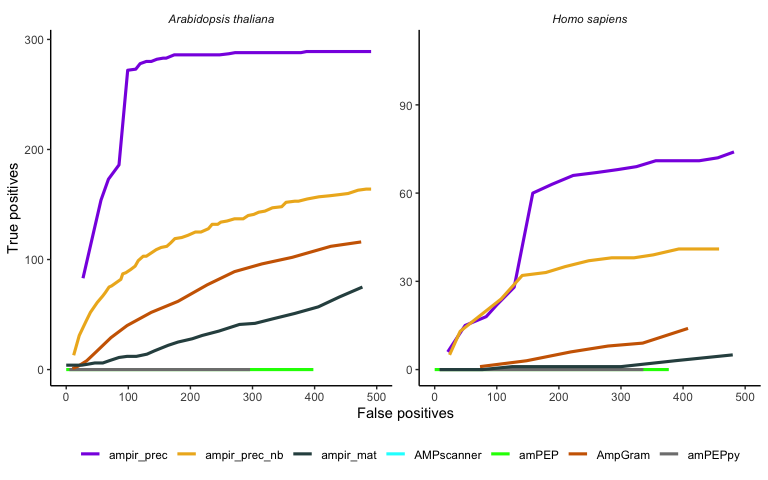

Benchmarking predictors
================

The reference proteomes for the organisms *Homo sapiens* (human),
proteome ID: up000005640, and *Arabidopsis thaliana* (mouse-ear cress),
proteome ID: up000006548, were downloaded from UniProt proteomes
(accessed 23 Jan 2021). *H. sapiens* contained 20,379 reviewed proteins
and 55,398 unreviewed proteins. *A. thaliana* contained 15,956 reviewed
and 23,390 unreviewed proteins.

``` r
human_proteome <- read_tsv("data/proteomes/uniprot-proteome UP000005640.tab") %>% mutate(Label = case_when(str_detect(`Keyword ID`, "KW-0929") ~ "Pos", TRUE ~ "Neg"))
cress_proteome <- read_tsv("data/proteomes/uniprot-proteome UP000006548.tab") %>% mutate(Label = case_when(str_detect(`Keyword ID`, "KW-0929") ~ "Pos", TRUE ~ "Neg"))

reference_proteomes <- rbind(human_proteome, cress_proteome)
```

## ampir

``` r
cress_pred_ampir_prec <- cress_proteome %>% select(`Entry name`, Sequence) %>% as.data.frame() %>% predict_amps(n_cores = 3) %>% add_column(Model = "ampir_precursor")

cress_pred_ampir_mat <- cress_proteome %>% select(`Entry name`, Sequence) %>% as.data.frame() %>% predict_amps(n_cores = 3, model = "mature")%>% add_column(Model = "ampir_mature")

human_pred_ampir_prec <- human_proteome %>% select(`Entry name`, Sequence) %>% as.data.frame() %>% predict_amps(n_cores = 3) %>% add_column(Model = "ampir_precursor")

human_pred_ampir_mat <- human_proteome %>% select(`Entry name`, Sequence) %>% as.data.frame() %>% predict_amps(n_cores = 3, model = "mature")  %>% add_column(Model = "ampir_mature")
```

In addition to ampir’s standard models (`ampir_precursor` and
`ampir_mature`), a special model was trained with sequences present in
the `ampir_precursor` model, **minus** any *H. sapiens* or *A. thaliana*
proteins (see ampir’s analysis repository,
[AMP\_pub](https://github.com/Legana/AMP_pub), workflow
02\_build\_training\_data for details). This was done to remove any
potential biases when testing the trained models on the *H. sapiens* and
*A. thaliana* proteomes.

``` r
ampir_prec_model_nobench <- readRDS("data/ampir_v1/tuned_precursor_imbal_nobench.rds")

cress_pred_ampir_nobench <- cress_proteome %>% select(`Entry name`, Sequence) %>% as.data.frame() %>% predict_amps( n_cores=1, model = ampir_prec_model_nobench) %>% add_column(Model = "ampir_precursor_nobench")

human_pred_ampir_nobench <- human_proteome %>% select(`Entry name`, Sequence) %>% as.data.frame() %>% predict_amps( n_cores=1, model = ampir_prec_model_nobench) %>% add_column(Model = "ampir_precursor_nobench")
```

``` r
ampir_proteome_predictions <- rbind(cress_pred_ampir_prec, cress_pred_ampir_mat, cress_pred_ampir_nobench, human_pred_ampir_prec, human_pred_ampir_mat, human_pred_ampir_nobench) %>% left_join(reference_proteomes, by = "Entry name") %>% select(ID = `Entry name`, prob_AMP, Organism, Label, Model)
```

To use the human and *Arabidopsis* proteomes in other predictors, first
the non-standard amino acids are removed. This is because the majority
of AMP predictors only accept sequences that contain standard amino
acids. ampir contains a function that removes everything which is not a
standard amino acid, but other predictors, such as AMP scanner, require
sequences to be preprocessed to have these sequences removed prior to
analysing the sequences. Therefore, the `remove_nonstandard_aa.R`
function from ampir is used to remove sequences that contain nonstandard
amino acids, and ampir’s `df_to_faa.R` function is used to write the
files as FASTA files as input to other predictors. In addition, due to
sequence amount restrictions using predictor web interfaces, the
*Arabidopsis* proteome is split in half and the human proteome is split
threefold.

``` r
arab_prot_clean <- read_faa("data/proteomes/arabidopsis-proteomeUP000006548.fasta") %>% remove_nonstandard_aa() 
df_to_faa(arab_prot_clean, "cache/arab_proteome_standardaa.fasta")

arab_prot_clean %>% slice((1:19669)) %>% df_to_faa("cache/arab_prot_clean1.fasta")
arab_prot_clean %>% slice((19670:n())) %>% df_to_faa("cache/arab_prot_clean2.fasta")

homo_prot_clean <- read_faa("data/proteomes/human-proteomeUP000005640.fasta") %>% remove_nonstandard_aa()
df_to_faa(homo_prot_clean, "cache/homo_proteome_standardaa.fasta")

homo_prot_clean %>% slice((1:22494)) %>% df_to_faa("cache/homo_prot_clean1.fasta")
homo_prot_clean %>% slice((22495:44988)) %>% df_to_faa("cache/homo_prot_clean2.fasta")
homo_prot_clean %>% slice((44989:n())) %>% df_to_faa("cache/homo_prot_clean3.fasta")
```

## Antimicrobial Peptide Scanner vr. 2

AMP scanner vr. 2 (model Feb 2020)

``` r
ampscanner_file_paths <- c(list.files("data/prediction_results/ampscanner_v2", pattern="*.csv",full.names = T))

ampscan_genome_bench <- do.call(rbind,lapply(ampscanner_file_paths,read_csv)) %>% 
  separate(SeqID,into = c("database","Entry","Entry name"),sep = "\\|") %>% 
  left_join(reference_proteomes,by="Entry name") %>% 
  select(ID = `Entry name`, prob_AMP = Prediction_Probability, Organism, Label) %>% 
  add_column(Model = "AMPscanner_v2")
```

## amPEP

``` r
ampep_file_paths <- c("data/prediction_results/ampep/arab_proteome_standardaa_ampep.txt","data/prediction_results/ampep/homo_proteome_standardaa_ampep.txt")

ampep_genome_bench <- do.call(rbind,lapply(ampep_file_paths,read_csv)) %>% 
  separate(Row, into = c("database","Entry","Entry name"),sep = "\\|") %>% 
  left_join(reference_proteomes, by = "Entry name") %>% 
  select(ID = `Entry name`, prob_AMP = score, Organism, Label) %>% 
  add_column(Model = "amPEP")
```

## amPEPpy

amPEPpy was run according to the example provided on the [amPEPpy GitHub
repository](https://github.com/tlawrence3/amPEPpy) in a Conda
environment. The prediction results consist of 67,484 predictions from
the original

``` python
ampep predict -m pretrained_models/amPEP.model -i ../cache/arab_proteome_standardaa.fasta -o arab_results.tsv --seed 2012
ampep predict -m pretrained_models/amPEP.model -i ../cache/homo_proteome_standardaa.fasta -o homo_results.tsv --seed 2012
```

``` r
ampeppy_file_paths <- list.files("data/prediction_results/amPEPpy", pattern="*.tsv",full.names = T)

ampeppy_genome_bench <- do.call(rbind,lapply(ampeppy_file_paths,read_tsv)) %>%
  separate(seq_id, into = c(NA, NA,"Entry name"),sep = "\\|") %>%
  left_join(reference_proteomes, by = "Entry name") %>% 
  select(ID = `Entry name`, prob_AMP = probability_AMP, Organism, Label) %>% 
  add_column(Model = "amPEPpy")
```

## AMPlify

AMPlify v1.0.0 was installed as the latest release from [AMPlify’s
repository](https://github.com/bcgsc/AMPlify). However, when using
AMPlify to predict proteins an error arose, related to the software
itself, and therefore unfortunately could not be included in the
benchmark. An issue was raised with details about this error on the
[AMPlify’s issue page](https://github.com/bcgsc/AMPlify/issues/1) on
10/02/2021.

## AMPgram

In order to significantly speed up the progress of using AmpGram on the
*A. thaliana* and *H. sapiens* proteomes, high performance computing
(HPC) scheduler (PBS) with job arrays submissions were used. To
accomplish this, first, both proteomes were split into FASTA files
containing 100 protein sequences (394 FASTA files for *A. thaliana* and
675 for *H. sapiens*) using the scripts `scripts/subset_arab_file.zsh`
and `subset_homo_proteome.zsh`. Per job, approximately 100 subjobs which
referenced to 100 FASTA files were used. See `scripts/runampgram_h1.sh`
and `scripts/runampgram_h1.R` as example scripts used for the first 100
subjobs/FASTA files from the *H. sapiens* proteome.

Initially when the jobs were submitted, various subjobs failed (three
for *A. thaliana* and 62 for *H. sapiens*). After examining the [source
code for
AmpGram](https://github.com/michbur/AmpGram/blob/master/R/utils.R), it
appears that AmpGram does not support sequences less than 10 amino acids
long. In the *A. thaliana* proteome (with non standard amino acids
removed) there were three proteins less than 10 amino acids long and in
*H. sapiens* there were 268. Therefore these sequences were not included
in the prediction analysis from AmpGram.

\*AmpGram’s prediction results is a list for each protein prediction
that is subdivided into three sublists. For this benchmark analysis,
only the third sublist is relevant as this contains the probability
score for that protein. A function was written to easily extract this
probability score and associated protein name from each output file.

``` r
gimme_ampgram_predictions <- function(filepath) {
  
  ampgram_list <- readRDS(filepath)

  amgram_probandnamelist <- lapply(ampgram_list, '[[', 3)

  bind_rows(amgram_probandnamelist, .id = "ID")
}
```

``` r
if (file.exists("cache/ampgram_genome_bench.rds")) {
  ampgram_genome_bench <- readRDS("cache/ampgram_genome_bench.rds")
} else {
  
ampgram_filepaths <- list.files(c("data/prediction_results/ampgram/homo", "data/prediction_results/ampgram/homo/leftovers", "data/prediction_results/ampgram/arab"), pattern="*.rds",full.names = T)

ampgram_predictions <- map_df(ampgram_filepaths, gimme_ampgram_predictions)
  
ampgram_genome_bench <- ampgram_predictions %>%
  separate(ID, into = c(NA, NA,"Entrynamewdescr"),sep = "\\|") %>%
  separate(Entrynamewdescr, into = c("Entry name", NA), sep = "\t", fill = "left") %>%
  left_join(reference_proteomes, by = "Entry name") %>% 
  select(ID = `Entry name`, prob_AMP = "TRUE", Organism, Label) %>% 
  add_column(Model = "AmpGram")
}
```

### Calculating performance metrics - ROC curves

A function, `get_genome_roc.R` was written to use `calc_cm_metrics.R` to
calculate performance metrics over a range of predicted probability (0 -
0.99) values, which include metrics necessary to construct ROC curves
(false positive rate and true positive rate)

``` r
source("scripts/calc_cm_metrics.R")

organisms = c("Homo sapiens (Human)","Arabidopsis thaliana (Mouse-ear cress)")

get_genome_roc <- function(data, model_name){
  do.call(rbind,lapply(organisms,function(org){ 
    map_df(c(seq(0.01, 0.99, 0.01),seq(0.99, 0.990, 0.001)), calc_cm_metrics, data %>% filter(Organism==org)) %>%
    add_column(Organism = org)
  })) %>%   
  add_column(Model = model_name)
}
```

To use `get_genome_roc.R` on ampir data, an additional loop had to be
implemented as in this case, ampir is subdivided into three different
models and therefore metric calculations needed to be done three
different times, one for each model.

``` r
ampir_genome_roc <- do.call(rbind,lapply(c("ampir_precursor","ampir_mature", "ampir_precursor_nobench"),function(meth){
    get_genome_roc(ampir_proteome_predictions %>% filter(Model==meth),meth)}))
```

``` r
ampscanner_roc <- get_genome_roc(ampscan_genome_bench, "AMPscanner_v2")

ampep_roc <- get_genome_roc(ampep_genome_bench, "amPEP")

ampgram_roc <- get_genome_roc(ampgram_genome_bench, "AmpGram")

ampeppy_roc <- get_genome_roc(ampeppy_genome_bench, "amPEPpy")
```

*combine ROC metric dataframes*

``` r
proteome_rocs <- rbind(ampir_genome_roc, ampscanner_roc, ampep_roc, ampgram_roc, ampeppy_roc)
```

## Plots

ROC curves, based on the false and true positive rates, and subsequent
AUROCs are often used to evaluate model performance but these can be
misleadingly confident when used on a dataset that is highly imbalanced,
i.e. where one class heavily outweighs the other [Davis & Goadrich
2006](https://doi.org/10.1145/1143844.1143874). A more accurate
alternative would be to use precision and recall (PR) curves as these
focus on the proportion of actual true positives within the positive
predictions [Saito & Rehmsmeier
2015](https://dx.doi.org/10.1371%2Fjournal.pone.0118432), rather than
including the true negatives, as the false positive rates in the ROC
curves do. As the proportion of AMPs in a genome is extremely low, the
AMP prediction models would have to perform on a highly imbalanced
dataset and therefore the precision recall curves are additionally used
in this study. ROC curves are evaluated on their shape, generally curves
that arc closer to the top left corner (similar to a capital gamma Γ
shape), as well as their AUC values. The AUC values range between 0.0
and 1.0 where 0.0 the model cannot tell the classes apart at all and 1.0
the model is able to distinguish between classes perfectly. Generally,
an AUC of 0.5 already indicates that the model struggles to
differentiate between classes. On the ROC curve plot, an AUC of 0.5
makes a diagonal line from the bottom left to the top right corner. The
perfect PR curve is like a mirror image of the perfect ROC curve; it
bends at the top right corner, which refers to the model performing with
100% recall and precision. Therefore, the more the PR curves bend toward
the top right corner, the better the model is. When comparing multiple
curves on the same plot, the curve that is above another curve, is
generally assumed to perform better.

Figure 3.1 shows both the ROC curves (top row) and the PR curves (bottom
row) for the prediction results from various AMP predictors on the *H.
sapiens* and *A. thaliana* proteomes. It is clear that the ROC curves
overall show a better performance compared to the PR curves which
corroborates the findings of David and Goadrich (2006) and Saito and
Rehsmeier (2015). The AUC values for the ROC curves range between 0.16 -
0.99 for *A. thaliana* and 0.43 - 0.92 for *H. sapiens*. The AUC values
for the PR curves are between 0.004 - 0.73 for *A. thaliana* and 0.001 -
0.15 for *H. sapiens*, which are overall much lower compared to the
AUROC values. Interestingly, all models, with exception to amPEP, had
higher AUC values for both ROC and PR curves for *A thaliana*. This may
indicate the models were better at detecting AMPs in *A. thaliana*
compared to *H. sapiens*. The ampir precursor model had the highest
PRAUC value on the *A. thaliana* proteome (PRAUC: 0.73). However, the
remaining PRAUC values (for both proteomes) are below 0.31. Therefore,
according to the AUPRC metric, which has been stated to be more
informative on imbalanced datasets, none of the models (save perhaps the
ampir precursor model on *A. thaliana*) were skilled enough to detect
AMPs in the *H. sapiens* and *A. thaliana* proteomes.

<!-- -->

**Figure 3.1:** Performance of various AMP predictors in classifying
whole proteome data for *Homo sapiens* and *Arabidopsis thaliana*.
Performance is shown as ROC curves (top row) and precision-recall curves
(second row). H refers to *Homo sapiens* and A refers to *Arabidopsis
thaliana*. The numbers that follow are the respective AUC values for
either the ROC or PR curve.

Similar to how the ROC curves were calculated, a function,
`get_metrics.R`, was written to calculate performance metrics, which
include the area under the curve (AUC) for both the ROC and
Precision-recall curves, of the various AMP models tested on the *H.
sapiens* and *A. thaliana* proteomes.

``` r
source("scripts/calculate_model_metrics.R")

get_metrics <- function(bench_data, model_name) {
  do.call(rbind,lapply(c("Homo sapiens (Human)","Arabidopsis thaliana (Mouse-ear cress)"),function(org){
    calculate_model_metrics(bench_data %>% filter(Organism==org)) %>%
      add_column(Organism = org) %>% 
      add_column(Model = model_name)
    }))
}

ampir_metrics <- do.call(rbind, lapply(c("ampir_precursor","ampir_mature", "ampir_precursor_nobench"),function(meth) {
  get_metrics(ampir_proteome_predictions %>% filter(Model==meth), model_name = meth)
}))

ampscan_metrics <- get_metrics(ampscan_genome_bench, "AMPscanner_v2")
ampep_metrics <- get_metrics(ampep_genome_bench, "amPEP")
ampgram_metrics <- get_metrics(ampgram_genome_bench, "AmpGram")
ampeppy_metrics <- get_metrics(ampeppy_genome_bench, "amPEPpy")

proteome_metrics <- rbind(ampir_metrics, ampscan_metrics, ampep_metrics, ampgram_metrics, ampeppy_metrics) %>% mutate(Organism = case_when(str_detect(Organism, "Homo") ~ "H. sapiens", TRUE ~ "A. thaliana"))
```

**Table 3.1:** Performance metrics of various predictors on the
proteomes of *Homo sapiens* and *Arabidopsis thaliana*

| Specificity | Recall | Precision |    F1 |    MCC | AUROC | AUPRC | Organism    | Model                     |
|------------:|-------:|----------:|------:|-------:|------:|------:|:------------|:--------------------------|
|       0.971 |  0.755 |     0.041 | 0.078 |  0.172 | 0.918 | 0.150 | H. sapiens  | ampir\_precursor          |
|       0.986 |  0.986 |     0.346 | 0.512 |  0.580 | 0.996 | 0.727 | A. thaliana | ampir\_precursor          |
|       0.049 |  1.000 |     0.002 | 0.004 |  0.009 | 0.753 | 0.004 | H. sapiens  | ampir\_mature             |
|       0.007 |  1.000 |     0.008 | 0.016 |  0.008 | 0.971 | 0.154 | A. thaliana | ampir\_mature             |
|       0.970 |  0.573 |     0.030 | 0.057 |  0.127 | 0.860 | 0.090 | H. sapiens  | ampir\_precursor\_nobench |
|       0.988 |  0.554 |     0.258 | 0.352 |  0.371 | 0.927 | 0.312 | A. thaliana | ampir\_precursor\_nobench |
|       0.499 |  0.918 |     0.003 | 0.006 |  0.034 | 0.787 | 0.006 | H. sapiens  | AMPscanner\_v2            |
|       0.468 |  0.997 |     0.014 | 0.028 |  0.080 | 0.917 | 0.087 | A. thaliana | AMPscanner\_v2            |
|       0.495 |  0.391 |     0.001 | 0.002 | -0.009 | 0.425 | 0.001 | H. sapiens  | amPEP                     |
|       0.484 |  0.024 |     0.000 | 0.000 | -0.085 | 0.158 | 0.004 | A. thaliana | amPEP                     |
|       0.619 |  0.800 |     0.003 | 0.006 |  0.035 | 0.806 | 0.013 | H. sapiens  | AmpGram                   |
|       0.591 |  0.864 |     0.016 | 0.031 |  0.080 | 0.859 | 0.138 | A. thaliana | AmpGram                   |
|       0.522 |  0.273 |     0.001 | 0.002 | -0.017 | 0.487 | 0.001 | H. sapiens  | amPEPpy                   |
|       0.316 |  0.031 |     0.000 | 0.000 | -0.121 | 0.240 | 0.005 | A. thaliana | amPEPpy                   |

``` r
proteome_metrics_long <- pivot_longer(proteome_metrics[,3:11], cols = c(-Organism, -Model))

library(pals)
ggplot(proteome_metrics_long, aes(x = name, y = value)) +
  geom_bar(stat = "identity", aes(fill = Model), position = "dodge") +
  facet_wrap(~Organism) +
  theme_classic() +
  theme(legend.position = "bottom") +
  scale_fill_manual(values = watlington(7)) +
  labs(x = "", fill = "")
```

<!-- -->

``` r
ggsave("figures/proteome_metrics_groupedbar.png", width = 20, height = 16, units = "cm")

ggplot(proteome_metrics_long, aes(x = Model, y = value)) +
  geom_point(aes(colour = Model, shape = Model)) +
  facet_grid(Organism ~ name ) +
  scale_shape_manual(values=c(0, 1, 3, 5, 8, 16, 17)) + 
  labs(colour = "", shape = "") +
  theme_bw() +
  theme(legend.position = "bottom",
        axis.title.x=element_blank(),
        axis.text.x=element_blank(),
        axis.ticks.x=element_blank())
```

<!-- -->

``` r
ggsave("figures/proteome_metrics_points.png", width = 20, height = 16, units = "cm")
```

The metrics overall are really low for the ability of models to predict
AMPs in proteomes. However, these metrics may not be a very informative
evaluation.

It is important to remember the real life situation and applications of
predictive models. The actual frequency of AMPs (true positives) in a
proteome is approximately 1%. This is extremely low. To adequately
express the real-world performance of predictors on proteomes, the
numbers of true and false positives were used, with a focus on the low
false positive regime, as this is what matters most in whole proteome
scans (Figure 3.2)

<!-- -->

**Figure 3.2:** The ability of various models to predict AMPs in the low
false positive regime (&lt;500) in the proteomes of *Arabidopsis
thaliana* and *Homo sapiens*. It is scaled so that the limits of the
y-axis show the full complement of known AMPs in each genome (294 for
*A. thaliana*, 112 for *H. sapiens*), and the limits of the x-axis are
restricted to emphasise behaviour in the low false positive (FP) regime
(FP &lt; 500).

<!-- -->

**Figure 3.3:** Same as Figure 3.2 but showing the entire false positive
regime
