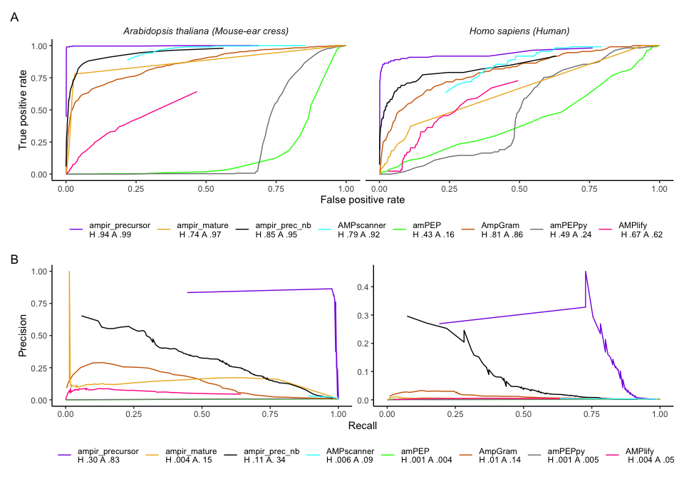
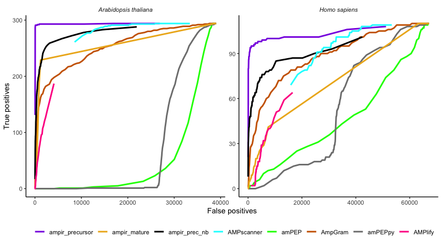

Benchmarking in an ’omics-scanning context
================

# Preparing Prediction Data

We benchmarked each of the AMP predictors against the following
datasets:

-   A balanced test dataset as close as possible to the original test
    data used by the authors of the predictor
-   An unbalanced
    ()
    dataset created as a random subsample of the original test data used
    by the authors
-   The reference proteome of *Homo sapiens* (human), obtained from
    Uniprot, proteome ID: up000005640
-   The reference proteome of *Arabidopsis thaliana* (mouse-ear cress),
    obtained from Uniprot, proteome ID: up000006548

Both Uniprot datasets were downloaded from UniProt proteomes (accessed
23 Jan 2021). In order to ensure that the same data could be used across
all predictors we first preprocessed these proteomes to comply with
input requirements of all predictors. Specifically we:

-   Removed all non-standard amino acids
-   Removed all peptides shorter than 10 amino acids

### ampir

As shown in Figure 1.1 the training data for `ampir` includes precursor
protein sequences for both Human and Arabidopsis. In order to avoid
calculating inflated performance metrics for `ampir` we therefore
retrained its model after first removing any *H. sapiens* or *A.
thaliana* proteins. We report three separate benchmarks for `ampir`
(v1.1) as follows:

-   `ampir_precursor` : ampir using the unmodified precursor model
-   `ampir_prec_nb` : ampir using the precursor model with Human and
    Arabidopsis proteins removed
-   `ampir_mature` : ampir using mature peptides

The training and test data for the AMP predictors are outlined in
[01_data_comparison.md](01_data_comparison.md), Table 1.1. Predictors
were run in January 2021.

## Antimicrobial Peptide Scanner vr. 2 ()

AMPscanner vr.2 Feb2020 model was used via the [AMPscanner
webserver](https://www.dveltri.com/ascan/v2/ascan.html)

## amPEP

amPEP MATLAB source code was accessed from
[sourceforge](https://sourceforge.net/projects/axpep/files/AmPEP_MATLAB_code/)
in January 2021.

## amPEPpy

amPEPpy v.1.0 was run according to the example provided on the [amPEPpy
GitHub repository](https://github.com/tlawrence3/amPEPpy) in a Conda (v.
4.10.0) environment (commands shown below).

``` bash
ampep predict -m pretrained_models/amPEP.model -i ../cache/arab_proteome_standardaa.fasta -o arab_results.tsv --seed 2012
ampep predict -m pretrained_models/amPEP.model -i ../cache/homo_proteome_standardaa.fasta -o homo_results.tsv --seed 2012
```

## AMPlify

AMPlify v1.0.0 was installed as the latest release from [AMPlify’s
repository](https://github.com/bcgsc/AMPlify). However, when using
AMPlify to predict proteins an error arose, related to the software
itself, and therefore unfortunately could not be included in the
benchmark. An issue was raised with details about this error on the
[AMPlify’s issue page](https://github.com/bcgsc/AMPlify/issues/1) on
10/02/2021.

Update: when looking at the commit history, a
[commit](https://github.com/bcgsc/AMPlify/commit/2c44491b7a8f4815b154307f5b250f991942935a)
was found which looked like it would fix the issue. After installing the
released version, I changed the source code for the software according
to the previously mentioned commit, and the software worked after that.

AMPlify is optimised for protein sequences that are 200 AA or less and
do not allow input data to contain sequences larger than 200 amino
acids. Therefore, only proteins that were =\< 200 AA were kept in the
proteomes (9,027 for *A. thaliana* from 39,340 standard AA sequences and
33,584 for *H. sapiens* from 67,484 standard AA sequences)

## AMPgram

In order to significantly speed up the progress of using AmpGram v. 1.0
on the *A. thaliana* and *H. sapiens* proteomes, high performance
computing (HPC) scheduler (PBS) with job arrays submissions were used
(with R v. 4.0.3). To accomplish this, first, both proteomes were split
into FASTA files containing 100 protein sequences (394 FASTA files for
*A. thaliana* and 675 for *H. sapiens*) using the scripts
`scripts/subset_arab_file.zsh` and `subset_homo_proteome.zsh`. Per job,
approximately 100 subjobs which referenced to 100 FASTA files were used.
See `scripts/runampgram_h1.sh` and `scripts/runampgram_h1.R` as example
scripts used for the first 100 subjobs/FASTA files from the *H. sapiens*
proteome.

Initially when the jobs were submitted, various subjobs failed (three
for *A. thaliana* and 62 for *H. sapiens*). After examining the [source
code for
AmpGram](https://github.com/michbur/AmpGram/blob/master/R/utils.R), it
appears that AmpGram does not support sequences less than 10 amino acids
long. In the *A. thaliana* proteome (with non standard amino acids
removed) there were three proteins less than 10 amino acids long and in
*H. sapiens* there were 268. Therefore these sequences were not included
in the prediction analysis from AmpGram.

\*AmpGram’s prediction results is a list for each protein prediction
that is subdivided into three sublists. For this benchmark analysis,
only the third sublist is relevant as this contains the probability
score for that protein. A function was written to easily extract this
probability score and associated protein name from each output file.

### Calculating performance metrics - ROC curves

A function, `get_genome_roc.R` was written to use `calc_cm_metrics.R` to
calculate performance metrics over a range of predicted probability (0 -
0.99) values, which include metrics necessary to construct ROC curves
(false positive rate and true positive rate)

To use `get_genome_roc.R` on ampir data, an additional loop had to be
implemented as in this case, ampir is subdivided into three different
models and therefore metric calculations needed to be done three
different times, one for each model.

## Plots

ROC curves, based on the false and true positive rates, and subsequent
AUROCs are often used to evaluate model performance but these can be
misleadingly confident when used on a dataset that is highly imbalanced,
i.e. where one class heavily outweighs the other [Davis & Goadrich
2006](https://doi.org/10.1145/1143844.1143874). A more accurate
alternative would be to use precision and recall (PR) curves as these
focus on the proportion of actual true positives within the positive
predictions [Saito & Rehmsmeier
2015](https://dx.doi.org/10.1371%2Fjournal.pone.0118432), rather than
including the true negatives, as the false positive rates in the ROC
curves do. As the proportion of AMPs in a genome is extremely low, the
AMP prediction models would have to perform on a highly imbalanced
dataset and therefore the precision recall curves are additionally used
in this study. ROC curves are evaluated on their shape, generally curves
that arc closer to the top left corner (similar to a capital gamma Γ
shape), as well as their AUC values. The AUC values range between 0.0
and 1.0 where 0.0 the model cannot tell the classes apart at all and 1.0
the model is able to distinguish between classes perfectly. Generally,
an AUC of 0.5 already indicates that the model struggles to
differentiate between classes. On the ROC curve plot, an AUC of 0.5
makes a diagonal line from the bottom left to the top right corner. The
perfect PR curve is like a mirror image of the perfect ROC curve; it
bends at the top right corner, which refers to the model performing with
100% recall and precision. Therefore, the more the PR curves bend toward
the top right corner, the better the model is. When comparing multiple
curves on the same plot, the curve that is above another curve, is
generally assumed to perform better.

Figure 3.1 shows both the ROC curves (top row) and the PR curves (bottom
row) for the prediction results from various AMP predictors on the *H.
sapiens* and *A. thaliana* proteomes. It is clear that the ROC curves
overall show a better performance compared to the PR curves which
corroborates the findings of David and Goadrich (2006) and Saito and
Rehsmeier (2015). The AUC values for the ROC curves range between 0.16 -
0.99 for *A. thaliana* and 0.43 - 0.92 for *H. sapiens*. The AUC values
for the PR curves are between 0.004 - 0.73 for *A. thaliana* and 0.001 -
0.15 for *H. sapiens*, which are overall much lower compared to the
AUROC values. Interestingly, all models, with exception to amPEP, had
higher AUC values for both ROC and PR curves for *A thaliana*. This may
indicate the models were better at detecting AMPs in *A. thaliana*
compared to *H. sapiens*. The ampir precursor model had the highest
PRAUC value on the *A. thaliana* proteome (PRAUC: 0.73). However, the
remaining PRAUC values (for both proteomes) are below 0.31. Therefore,
according to the AUPRC metric, which has been stated to be more
informative on imbalanced datasets, none of the models (save perhaps the
ampir precursor model on *A. thaliana*) were skilled enough to detect
AMPs in the *H. sapiens* and *A. thaliana* proteomes.

<!-- -->

**Figure 3.1:** Performance of various AMP predictors in classifying
whole proteome data for *Homo sapiens* and *Arabidopsis thaliana*.
Performance is shown as ROC curves (top row) and precision-recall curves
(second row). H refers to *Homo sapiens* and A refers to *Arabidopsis
thaliana*. The numbers that follow are the respective AUC values for
either the ROC or PR curve.

Similar to how the ROC curves were calculated, a function,
`get_metrics.R`, was written to calculate performance metrics, which
include the area under the curve (AUC) for both the ROC and
Precision-recall curves, of the various AMP models tested on the *H.
sapiens* and *A. thaliana* proteomes.

**Table 3.1:** Performance metrics of various predictors on the
proteomes of *Homo sapiens* and *Arabidopsis thaliana*

|  FPR | Accuracy | Specificity | Recall | Precision |   F1 |   MCC | AUROC | AUPRC | Organism    | Model                              |
|-----:|---------:|------------:|-------:|----------:|-----:|------:|------:|------:|:------------|:-----------------------------------|
| 0.03 |     0.97 |        0.97 |   0.86 |      0.05 | 0.09 |  0.20 |  0.94 |  0.30 | H. sapiens  | ampir_v1.1_precursor_imbal         |
| 0.01 |     0.99 |        0.99 |   0.99 |      0.38 | 0.54 |  0.60 |  1.00 |  0.83 | A. thaliana | ampir_v1.1_precursor_imbal         |
| 0.95 |     0.05 |        0.05 |   1.00 |      0.00 | 0.00 |  0.01 |  0.74 |  0.00 | H. sapiens  | ampir_v1.1_mature                  |
| 0.99 |     0.01 |        0.01 |   1.00 |      0.01 | 0.02 |  0.01 |  0.97 |  0.15 | A. thaliana | ampir_v1.1_mature                  |
| 0.03 |     0.97 |        0.97 |   0.56 |      0.03 | 0.06 |  0.13 |  0.85 |  0.11 | H. sapiens  | ampir_v1.1_precursor_imbal_nobench |
| 0.01 |     0.99 |        0.99 |   0.59 |      0.28 | 0.38 |  0.40 |  0.95 |  0.34 | A. thaliana | ampir_v1.1_precursor_imbal_nobench |
| 0.50 |     0.50 |        0.50 |   0.92 |      0.00 | 0.01 |  0.03 |  0.79 |  0.01 | H. sapiens  | AMPscanner_v2                      |
| 0.53 |     0.47 |        0.47 |   1.00 |      0.01 | 0.03 |  0.08 |  0.92 |  0.09 | A. thaliana | AMPscanner_v2                      |
| 0.51 |     0.49 |        0.49 |   0.39 |      0.00 | 0.00 | -0.01 |  0.42 |  0.00 | H. sapiens  | amPEP                              |
| 0.52 |     0.48 |        0.48 |   0.02 |      0.00 | 0.00 | -0.09 |  0.16 |  0.00 | A. thaliana | amPEP                              |
| 0.38 |     0.62 |        0.62 |   0.80 |      0.00 | 0.01 |  0.04 |  0.81 |  0.01 | H. sapiens  | AmpGram                            |
| 0.41 |     0.59 |        0.59 |   0.86 |      0.02 | 0.03 |  0.08 |  0.86 |  0.14 | A. thaliana | AmpGram                            |
| 0.48 |     0.52 |        0.52 |   0.27 |      0.00 | 0.00 | -0.02 |  0.49 |  0.00 | H. sapiens  | amPEPpy                            |
| 0.68 |     0.31 |        0.32 |   0.03 |      0.00 | 0.00 | -0.12 |  0.24 |  0.00 | A. thaliana | amPEPpy                            |
| 0.10 |     0.90 |        0.90 |   0.16 |      0.00 | 0.01 |  0.01 |  0.67 |  0.00 | H. sapiens  | AMPlify                            |
| 0.01 |     0.96 |        0.99 |   0.02 |      0.05 | 0.03 |  0.01 |  0.62 |  0.05 | A. thaliana | AMPlify                            |

<!-- -->

**Figure 3.2:** Performance of various AMP predictors in classifying
AMPs in whole proteome data for *Homo sapiens* and *Arabidopsis
thaliana*.

The metrics overall are really low for the ability of models to predict
AMPs in proteomes. However, these metrics may not be a very informative
evaluation.

It is important to remember the real life situation and applications of
predictive models. The actual frequency of AMPs (true positives) in a
proteome is approximately 1%. This is extremely low. To adequately
express the real-world performance of predictors on proteomes, the
numbers of true and false positives were used, with a focus on the low
false positive regime, as this is what matters most in whole proteome
scans (Figure 3.2)

<!-- -->

**Figure 3.3:** The ability of various models to predict AMPs in the low
false positive regime (\<500) in the proteomes of *Arabidopsis thaliana*
and *Homo sapiens*. It is scaled so that the limits of the y-axis show
the full complement of known AMPs in each genome (294 for *A. thaliana*,
112 for *H. sapiens*), and the limits of the x-axis are restricted to
emphasise behaviour in the low false positive (FP) regime (FP \< 500).

Note that AMP scanner isn’t visible in Figure 3.3 as it only predicts
outside the false positive regime (see Figure 3.4 below which is
identical to Figure 3.3 except that it shows the full x-axis)

<!-- -->

**Figure 3.4:** The ability of various models to predict AMPs in the
proteomes of *Arabidopsis thaliana* and *Homo sapiens* using the full
x-axis range.
