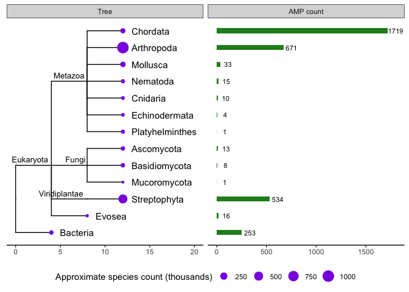
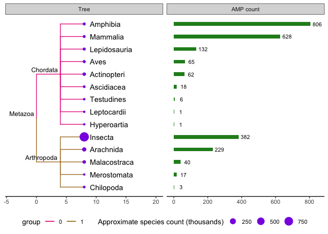
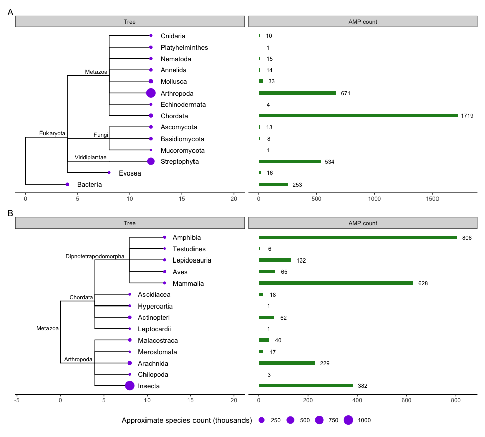
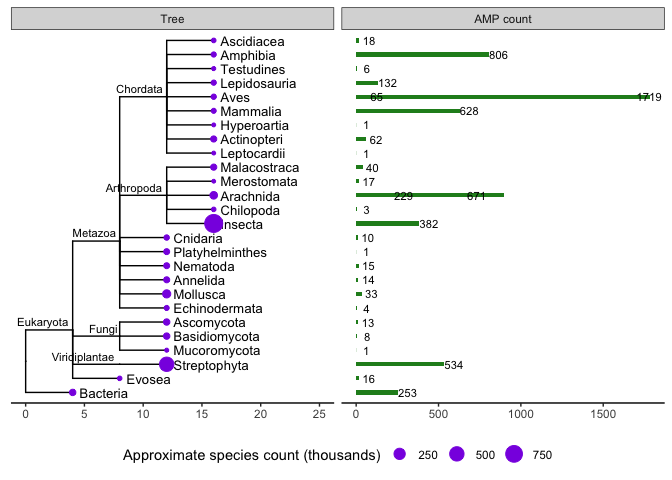

``` r
library(ggtree)
library(treeio)
library(tidyverse)
library(tidytree)
library(ape)
library(patchwork)
```

# Phylogenetic tree of organisms that contain AMPs in UniProt

``` r
swissprot_amps <- readxl::read_xlsx("data/uniprot-keyword-Antimicrobial+[KW-0929]-reviewed-April2021.xlsx") %>%
  rename(Taxonomic_lineage = `Taxonomic lineage (ALL)`) %>%
  rename(Phylum = `Taxonomic lineage (PHYLUM)`) %>%
  rename(Order = `Taxonomic lineage (ORDER)`) %>%
  rename(Class = `Taxonomic lineage (CLASS)`) %>%
  filter(!grepl("Viruses", Taxonomic_lineage)) %>%
  filter(!grepl("Archaea", Taxonomic_lineage)) %>%
  filter(!grepl("unclassified entries", Taxonomic_lineage)) %>%
  filter(!grepl("A0A6T9YU36", Entry)) %>%
  mutate(label = case_when(str_detect(Taxonomic_lineage, "Bacteria") ~ "Bacteria",
                               str_detect(Phylum, "Nematoda*") ~ "Nematoda",
                                               TRUE ~ Phylum))
```

Count the reviewed AMPs and add the approximate number of identified
species per phylum (Bacteria was kept at a kingdom level so tree
wouldn’t be overcrowded)

``` r
swissprot_amps_count <- swissprot_amps %>%
  count(label) %>%
  mutate(approx_species_n = c(22000, 1000000, 30000, 30000, 30000, 65000, 11000, 7000, 2400, 85000, 261, 20000, 20000, 500000)) %>%
  mutate(approx_species_n_thousand = approx_species_n / 1000) %>%
  rename(AMP_count = n) %>%
  mutate(percentage = round(AMP_count / sum(AMP_count) * 100, digits = 2))
```

The groups in the tax\_group column in `swissprot_amps_count` were used
to generate a phyilip tree with the [NCBI Taxonomy
Browser](https://www.ncbi.nlm.nih.gov/Taxonomy/CommonTree/wwwcmt.cgi)

Read in tree

``` r
tree_text <- readLines("data/tree/phylum_tree.phy") %>%
  paste0(collapse="")

tree <- read.tree(text = tree_text)
```

Match metadata to tree data to make geom\_facet work

``` r
newtree <- as_tibble(tree) %>% left_join(swissprot_amps_count) %>% as.treedata()
```

For some reason geom\_facet can’t find the metadata so make a copy of
the metadata and rename the data we want to plot …

``` r
swissprot_amps_count2 <- swissprot_amps_count %>% rename(AMP_count_2 = AMP_count)
```

### Plot

``` r
newtree_plot <- ggtree(newtree) +
  geom_tiplab(offset = 0.9, size= 4, color ="Black") +
  geom_nodelab(aes(label = label), size = 3.5, vjust = -0.5, hjust = 1.1 ) +
  geom_tippoint(aes(size = approx_species_n_thousand), colour = "blueviolet") +
  theme_tree2() +
  theme(legend.position = "bottom") +
  labs(size = "Approximate species count (thousands)") +
  xlim_expand(c(0, 20), panel = "Tree")
  
p2 <- facet_plot(newtree_plot, panel = "AMP count", data.frame(swissprot_amps_count2),
           geom = ggstance::geom_barh, mapping = aes(x = AMP_count_2), fill = "forestgreen", stat = "identity", width = .3) 

facet_plot(p2, panel = "AMP count", data = data.frame(swissprot_amps_count2), geom = geom_text, mapping = aes(x = AMP_count_2 + 80, label = AMP_count_2), size = 3)
```

<!-- -->

## Chordata and Arthropoda

Chordata represents more than half of the AMPs in SwissProt (52%) so
having a closer look at this phylum. the next most abundant group is
Arthropoda (\~20%) so looking at these also

``` r
chordata_arthropoda_amps <- swissprot_amps %>% filter(label %in% c("Chordata", "Arthropoda")) %>%
    mutate(Class = case_when(str_detect(Order, "Testudines") ~ "Testudines",
                           str_detect(Class, "Lepidosauria") ~ "Lepidosauria",
                           str_detect(Class, "Chilopoda") ~ "Chilopoda",
                           str_detect(Class, "Merostomata") ~ "Merostomata",
                                                        TRUE ~ Class))

chordata_arthropoda_amps_count <- chordata_arthropoda_amps %>%
  count(Class) %>%
  rename(label = Class) %>% 
  mutate(approx_species_n = c(24000, 8317, 65000, 3000, 10000, 2500, 38, 900000, 9000, 30, 25000, 6495, 4, 300 )) %>%
  mutate(approx_species_n_thousand = approx_species_n / 1000) %>%
  rename(AMP_count = n) %>%
  mutate(percentage = round(AMP_count / sum(AMP_count) * 100, digits = 2)) 
```

``` r
ca_tree_text <- readLines("data/tree/chordata_arthropodatree.phy") %>%
  paste0(collapse="")
ca_tree <- read.tree(text = ca_tree_text)

newcatree <- as_tibble(ca_tree) %>% left_join(chordata_arthropoda_amps_count) %>% as.treedata()

chordata_arthropoda_amps_count2 <- chordata_arthropoda_amps_count %>% rename(AMP_count2 = AMP_count)
```

## Plot

<!-- -->

### Combine tree plots

<!-- -->

## Combining the two trees and metadata

To see if tree looks better combined as 1 big tree rather than
subdivided….

``` r
fulltree_text <- readLines("data/tree/fulltree.phy") %>%
  paste0(collapse="")

fulltree <- read.tree(text = fulltree_text)
```

``` r
tree_data <- rbind(chordata_arthropoda_amps_count, swissprot_amps_count) %>% mutate(approx_species_n_thousand = approx_species_n / 1000)
```

``` r
newfulltree <- as_tibble(fulltree) %>% left_join(tree_data) %>% as.treedata()

tree_data2 <- tree_data %>% rename(AMP_count2 = AMP_count)
```

## plot

not sure if this is better as there are AMP counts for both the phylum
“Chordata” and for the classes within Chordata (and same for Arthropoda)
and they overlap on the AMP count panel plot which therefore looks messy
… and the extra groups make it look a bit busy (in the AMP count plot …)

``` r
newfulltree_plot <- ggtree(newfulltree) +
  geom_tiplab(offset = 0.5, size= 3.5, color ="Black") +
  geom_nodelab(aes(label = label), size = 3, vjust = -0.5, hjust = 1.1 ) +
  geom_tippoint(aes(size = approx_species_n_thousand), colour = "blueviolet") +
  theme_tree2() +
  theme(legend.position = "bottom") +
  labs(size = "Approximate species count (thousands)") +
  xlim_expand(c(0, 25), panel = "Tree")
  


f2 <- facet_plot(newfulltree_plot, panel = "AMP count", data.frame(tree_data2),
           geom = ggstance::geom_barh, mapping = aes(x =  AMP_count2), fill = "forestgreen", stat = "identity", width = .3) 

facet_plot(f2, panel = "AMP count", data = data.frame(tree_data2), geom = geom_text, mapping = aes(x = AMP_count2 + 60, label = AMP_count2), size = 3)
```

<!-- -->
