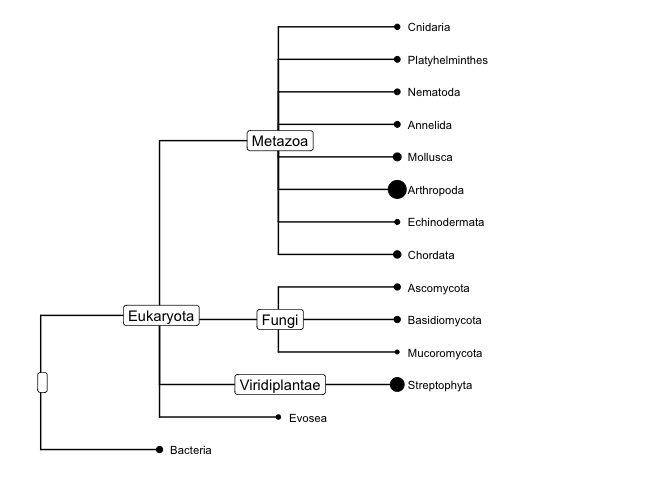
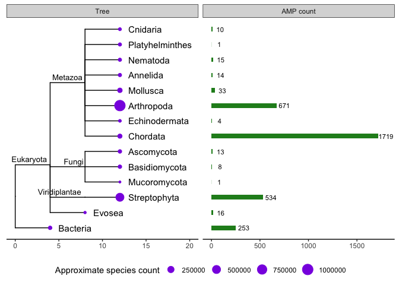

``` r
library(ggtree)
library(treeio)
library(tidyverse)
library(tidytree)
library(ape)
```

# Phylogenetic tree of organisms that contain AMPs in UniProt

``` r
uniprot_amps <- readxl::read_xlsx("data/uniprot-keyword-Antimicrobial+[KW-0929]April2021.xlsx") %>%
  rename(Taxonomic_lineage = `Taxonomic lineage (ALL)`) %>%
  rename(Phylum = `Taxonomic lineage (PHYLUM)`) %>%
  rename(Order = `Taxonomic lineage (ORDER)`) %>%
  filter(!grepl("Viruses", Taxonomic_lineage)) %>%
  filter(!grepl("Archaea", Taxonomic_lineage)) %>%
  filter(!grepl("unclassified entries", Taxonomic_lineage)) %>%
  filter(!grepl("A0A6T9YU36", Entry)) %>%
  mutate(label = case_when(str_detect(Taxonomic_lineage, "Bacteria") ~ "Bacteria",
                               str_detect(Phylum, "Nematoda*") ~ "Nematoda",
                                               TRUE ~ Phylum))
```

``` r
unreviewed_amps_count <- uniprot_amps %>% filter(Status == "unreviewed") %>%
  count(label) 
```

Count the reviewed AMPs and add the approximate number of identified
species per phylum (Bacteria was kept at a kingdom level so tree
wouldn’t be overcrowded)

``` r
swissprot_amps <- uniprot_amps %>% filter(Status == "reviewed")

swissprot_amps_count <- uniprot_amps %>% filter(Status == "reviewed") %>%
  count(label) %>%
  mutate(approx_species_n = c(22000, 1000000, 30000, 30000, 30000, 65000, 11000, 7000, 2400, 85000, 261, 20000, 20000, 500000)) %>%
  rename(AMP_count_rev = n)
```

The groups in the tax\_group column in `swissprot_amps_count` were used
to generate a phyilip tree with the [NCBI Taxonomy
Browser](https://www.ncbi.nlm.nih.gov/Taxonomy/CommonTree/wwwcmt.cgi)

Read in tree

``` r
tree_text <- readLines("data/tree/phylum_tree.phy") %>%
  paste0(collapse="")

tree <- read.tree(text = tree_text)
```

## Initial tree plot

``` r
ggtree(tree) %<+% swissprot_amps_count +
  geom_tiplab(offset = 0.3, size=3, color="Black") +
  xlim(NA,20) +
  theme(legend.position = "none") +
  geom_nodelab(aes(label = label), geom = "label") +
  geom_tippoint(aes(size = approx_species_n)) 
```

<!-- -->

Match metadata to tree data to make geom\_facet work

``` r
newtree <- as_tibble(tree) %>% left_join(swissprot_amps_count) %>% as.treedata()
```

## Plot

``` r
swissprot_amps_count2 <- swissprot_amps_count %>% rename(AMP_count_rev2 = AMP_count_rev)


ggtree(newtree) +
  geom_tiplab(offset = 0.9, size=3, color ="Black") +
  xlim(-5,40) +
  theme(legend.position = "none") +
      #  plot.margin = margin(1, 0.5, 1, 1, "cm")) + #t, r, b, l
  geom_nodelab(aes(label = label), size = 2.5, vjust = -0.5, hjust = 1.1 ) +
  geom_tippoint(aes(size = approx_species_n), colour = "blue") + 
  geom_facet(data = data.frame(swissprot_amps_count2), panel = "AMP count", geom = geom_point, mapping = aes(x = AMP_count_rev2))
```

<!-- -->
