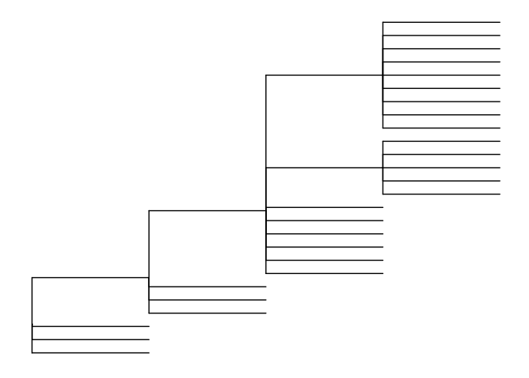
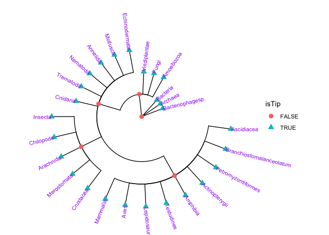
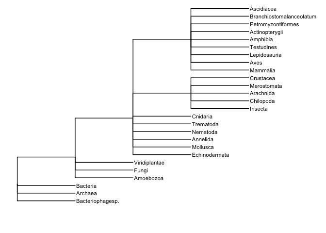

Untitled
================

``` r
library(ggtree)
library(treeio)
library(tidyverse)
```

``` r
tree_text <- readLines("data/tree/phyliptree.phy") %>%
  paste0(collapse="")

tree <- read.tree(text = tree_text) 
```

``` r
ggplot(tree) + 
  geom_tree() + 
  theme_tree()
```

<!-- -->

``` r
ggtree(tree, layout = "circular") + 
  geom_point(aes(shape=isTip, color=isTip), size=3) +
  geom_tiplab(size=3, color="purple") 
```

<!-- -->

``` r
ggtree(tree) + 
  geom_tiplab(size=3, color="Black") +
  coord_cartesian(clip = "off") +
  theme(legend.position = "none") +
  theme(plot.margin=margin(6, 100, 40, 6))
```

<!-- -->
