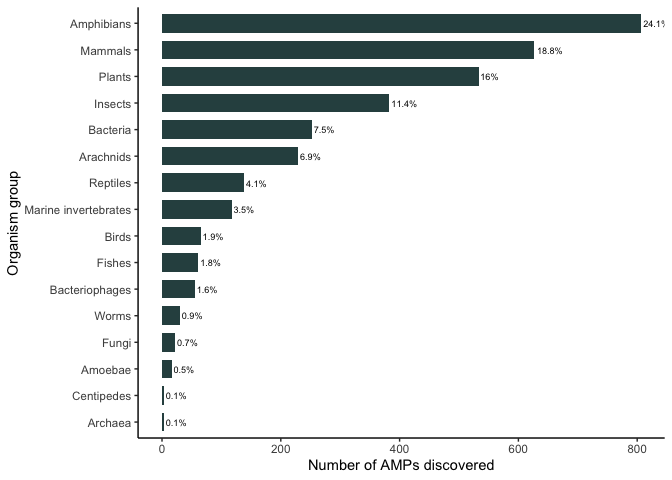
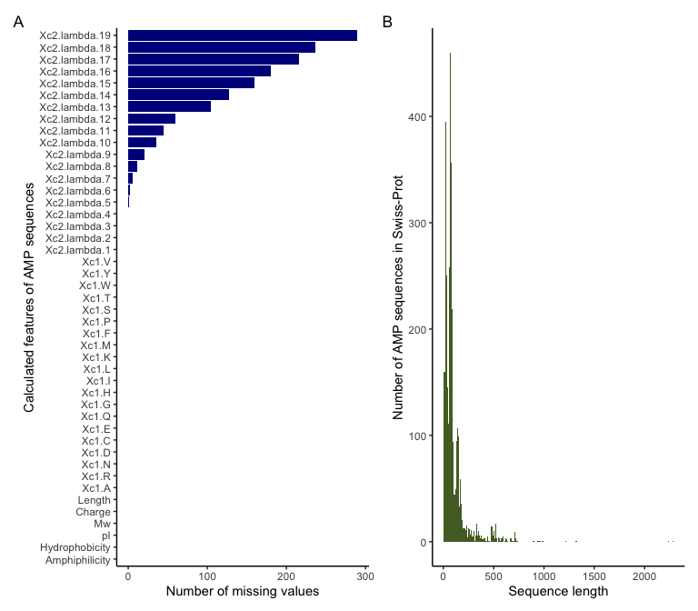
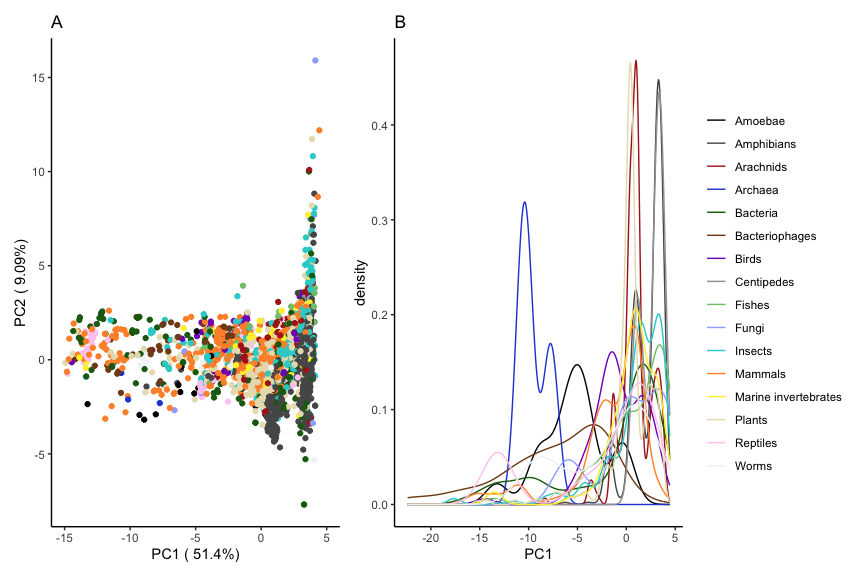
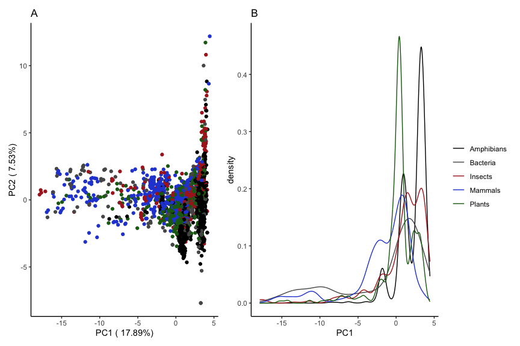

Taxonomic composition of Swiss-Prot AMPs
================

## Antimicrobial peptides in Swiss-Prot

UniProt AMPs were obtained from www.uniprot.org with the keyword
“antimicrobial” [KW-0929](https://www.uniprot.org/keywords/KW-0929). On
14 January 2021 this returned 3,339 Reviewed proteins and 41,477
Unreviewed proteins.

All 3,339 reviewed entries were downloaded as a tab separated file which
included the sequence and taxonomic lineage (CLASS and ALL) as
additional columns. Note that the CLASS column was not used in the code
analysis and therefore is not strictly necessary. However, it helped me
as a visual tool to group the organisms together.

``` r
swissprot_amps <- read_tsv("data/uniprot-keyword Antimicrobial+[KW-0929] -filtered-reviewed yes.tab") %>%
    rename(Class = `Taxonomic lineage (CLASS)`) %>%
    rename(Taxonomic_lineage = `Taxonomic lineage (all)`) %>%
    rename(Entry_name = `Entry name`) 
```

Organisms were grouped according to their taxonomic class as much as
possible. However, to simplify, some cases were grouped together by
colloquial terms for cases where multiple Class arrangements were
present or where using a different taxonomic level was easier, e.g. the
order Testudines (which includes the turtles) and order Squamata (which
includes lizards and snakes) were combined into the “Reptiles” group.
Furthermore, Ascidiacea (which includes sea squirts), Amphioxus
(lancelets), Cnidaria (includes jellyfishes), Echinodermata (includes
sea stars), Mollusca (includes octopods), Merostomata (horseshoe crabs)
and Crustacea (includes crabs) were all grouped into “Marine
invertebrates” as their individually known AMP count was low.

``` r
swissprot_amps_grouped <- swissprot_amps %>%
mutate(Taxonomic_lineage_grouped = case_when(
   str_detect(Taxonomic_lineage, "Mammalia") ~ "Mammals",
   str_detect(Taxonomic_lineage, "Insecta") ~ "Insects",
   str_detect(Taxonomic_lineage, "Arachnida") ~ "Arachnids",
   str_detect(Taxonomic_lineage, "Bacteria") ~ "Bacteria",
   str_detect(Taxonomic_lineage, "Viruses") ~ "Bacteriophages",
   str_detect(Taxonomic_lineage, "Amphibia") ~ "Amphibians",
   str_detect(Taxonomic_lineage, "Viridiplantae") ~ "Plants",
   str_detect(Taxonomic_lineage, "Fungi") ~ "Fungi",
   str_detect(Taxonomic_lineage, "Annelida") ~ "Worms",
   str_detect(Taxonomic_lineage, "Trematoda") ~ "Worms",
   str_detect(Taxonomic_lineage, "Nematoda") ~ "Worms",
   str_detect(Taxonomic_lineage, "lamprey") ~ "Fishes",
   str_detect(Taxonomic_lineage, "Actinopteri") ~ "Fishes",
   str_detect(Taxonomic_lineage, "Testudines") ~ "Reptiles",
   str_detect(Taxonomic_lineage, "Squamata") ~ "Reptiles", 
   str_detect(Taxonomic_lineage, "Aves") ~ "Birds", 
   str_detect(Taxonomic_lineage, "Ascidiacea") ~ "Marine invertebrates", 
   str_detect(Taxonomic_lineage, "Amphioxus") ~ "Marine invertebrates", 
   str_detect(Taxonomic_lineage, "Cnidaria") ~ "Marine invertebrates", 
   str_detect(Taxonomic_lineage, "Echinodermata") ~ "Marine invertebrates", 
   str_detect(Taxonomic_lineage, "Mollusca") ~ "Marine invertebrates",
   str_detect(Taxonomic_lineage, "Merostomata") ~ "Marine invertebrates",
   str_detect(Taxonomic_lineage, "Crustacea") ~ "Marine invertebrates",
   str_detect(Taxonomic_lineage, "Amoebozoa") ~ "Amoebae",
   str_detect(Taxonomic_lineage, "Archaea") ~ "Archaea",
   str_detect(Taxonomic_lineage, "Chilopoda") ~ "Centipedes",
                                        TRUE ~ Taxonomic_lineage))
```

``` r
swissprot_amp_counts <- swissprot_amps_grouped %>%
  group_by(Taxonomic_lineage_grouped) %>% 
  summarise(amp_count = n()) %>% 
  mutate(percentage = round(amp_count / sum(amp_count) * 100, digits = 1))
```

Amphibians make up the majority of AMPs in the Swiss-Prot database
(\~24%), followed by mammals (\~19%), arthropods (\~20%) and plants
(16%). Marine invertebrates, which include several large and diverse
taxonomic groups, represented here by cnidarians, echinoderms and
crustaceans, comprise only 3.5% of the currently known AMPs. It is clear
that there is substantial taxonomic bias in the organism groups that
represent the AMPs in Swiss-Prot.

### Plot

<!-- -->

**Figure 4.1:** Antimicrobial peptides (AMPs) present within groups of
organisms as obtained from SwissProt

## PCA of Swiss-Prot antimicrobial peptides

Machine learning models that classify AMPs often include physicochemical
properties that are calculated from protein sequences. To see if these
physicochemical properties differ between taxonomic groups, a principle
component analysis (PCA) was performed.

First ampir was used to calculate features of Swiss-Prot AMPs and the
resulting dataset was combined with the original Swiss-Prot data to
obtain the associated taxonomic annotations for each AMP.

``` r
sp_amps_features <- swissprot_amps %>% 
   select(Entry_name, Sequence) %>% 
   as.data.frame() %>% 
   remove_nonstandard_aa() %>% 
   calculate_features(min_len = 5) %>%
   left_join(swissprot_amps_grouped, by = c("seq_name" = "Entry_name"))
```

The `prcomp` function was used to perform the PCA. As`prcomp` only
allows numerical variables without missing values (`NA`s), the feature
dataset was examined for possible missing values (see Figure 4.2 A). The
only features containing missing values were the lambda values (between
5 and 19). These are values that relate to the sequence order effects
corresponding to the pseudo amino acid calculation [Chou
2001](https://doi.org/10.1002/prot.1035). As these values are dependent
on the sequence length, higher lambda values are likely to be associated
to longer sequences. The majority of AMPs in the Swiss-Prot database are
less than 500-800 amino acids long (see Figure 4.2 B) and there are only
four sequences longer than 1000 amino acids long. Therefore, the
increased number of missing values with increased lambda values is most
likely due to the lack of large sequences. As the number of larger
sequences that contain higher lambda values are relatively low, and
missing values are not supported in PCA analysis, the columns that
contain the lambda values between 5 and 19, were removed.

``` r
nasplot <- sp_amps_features %>% 
   select(c(2:45, Length)) %>%
   relocate(Length, .after = Charge) %>%
   summarise(across(everything(), ~ sum(is.na(.)))) %>%
   pivot_longer(everything(), names_to = "feature", values_to = "count")  %>%
   ggplot(aes(x = factor(feature, levels = unique(feature)), y = count)) +
   geom_col(fill = "darkblue") +
   coord_flip() +
   labs(y = "Number of missing values", x = "Calculated features of AMP sequences") +
   theme_classic() +
   ggtitle("A")

amplengths <- sp_amps_features %>%
   select(Length) %>%
   ggplot(aes(x = Length)) +
   geom_histogram(binwidth = 10, fill = "darkolivegreen") +
   labs(x = "Sequence length", y = "Number of AMP sequences in Swiss-Prot") +
   theme_classic() +
   ggtitle("B")


nasplot | amplengths
```

<!-- -->

**Figure 4.2:** *A)* Missing values present within AMP features. *B)*
Lengths of AMP sequences in Swiss-Prot

``` r
pca_features_amps <- sp_amps_features %>% 
   column_to_rownames(var = "seq_name") %>% 
   select(c(1:29, Length)) %>%
   prcomp(scale. = TRUE)

pca_w_annotations <- pca_features_amps$x %>% 
   as.data.frame() %>% 
   rownames_to_column("seq_name") %>% 
   left_join(swissprot_amps_grouped, by = c("seq_name" = "Entry_name")) %>%
   relocate(Taxonomic_lineage_grouped, .after = Length) %>%
    mutate(Deut_or_prot = case_when(
       str_detect(Taxonomic_lineage, "Deuterostomia") ~ "Deuterostome",
       str_detect(Taxonomic_lineage, "Protostomia") ~ "Protostome",
                                        TRUE ~ "Neither"))
```

``` r
pca_percentages <- round(pca_features_amps$sdev / sum(pca_features_amps$sdev) * 100, 2)
pca_percentages <- paste(colnames(pca_features_amps$x),"(",paste(as.character(pca_percentages), "%",")", sep = ""))
```

``` r
ggplot(pca_w_annotations, aes(x = PC1, y = PC2)) +
   geom_point(aes(colour = Taxonomic_lineage_grouped)) +
   xlim(-15, 5) +
   theme_classic() +
   theme(legend.position = "none") +
   labs(x = pca_percentages[1], y = pca_percentages[2]) +
   scale_colour_manual(values = watlington()) +

ggplot(pca_w_annotations, aes(x = PC1)) +
   stat_density(aes(colour = Taxonomic_lineage_grouped), geom = "line", position = "identity") +
   theme_classic() +
   theme(legend.position = "right") +
   labs(colour = "") +
   scale_colour_manual(values = watlington())
```

<!-- -->

``` r
unique(pca_w_annotations$Taxonomic_lineage_grouped)
```

    ##  [1] "Mammals"              "Insects"              "Bacteria"            
    ##  [4] "Fishes"               "Amphibians"           "Reptiles"            
    ##  [7] "Plants"               "Marine invertebrates" "Arachnids"           
    ## [10] "Birds"                "Worms"                "Bacteriophages"      
    ## [13] "Centipedes"           "Amoebae"              "Fungi"               
    ## [16] "Archaea"

``` r
vertebrates <- c("Mammals", "Amphibians", "Reptiles", "Birds", "Fishes")

bac_vs_verts <- c("Bacteria", vertebrates)

ggplot(filter(pca_w_annotations, Taxonomic_lineage_grouped %in% bac_vs_verts), aes(x = PC1)) +
   stat_density(aes(colour = Taxonomic_lineage_grouped), geom = "line", position = "identity") +
   labs(x = "PC1", colour = "") +
   theme(legend.position = "bottom") +
   guides(colour = guide_legend(nrow = 1))
```

<!-- -->
