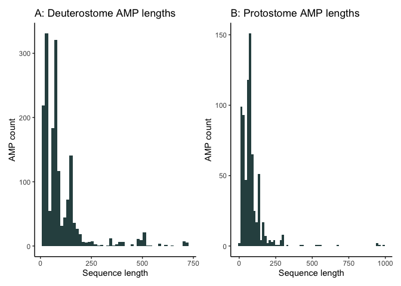
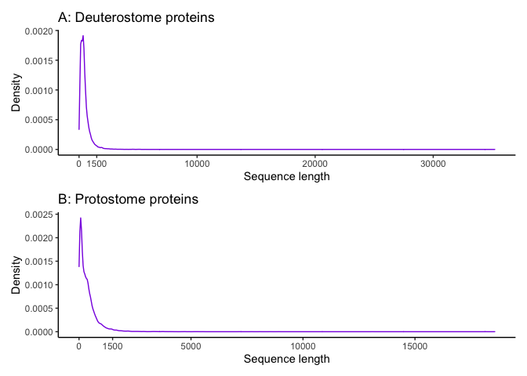
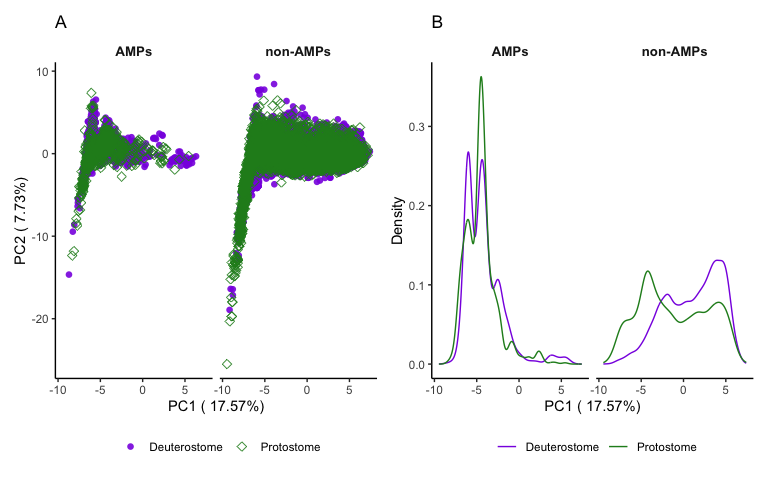

Taxonomic bias effect on model performance
================

## Positive datasets (antimicrobial peptides)

Known AMPs are not evenly distributed and are taxonomically biased. This
might influence the ability of a predictor to predict AMPs in an
organism that is not represented, or does not have close relatives, in
the positive AMP dataset. To investigate this, a predictive model was
trained on deuterostomes and tested on protostomes. Deuterostomia and
Protostomia are two well established clades that comprise the bilaterian
animals, which split over 500 million years ago [Heger et
al. 2020](https://doi.org/10.7554/eLife.45530) and contain the majority
of animal species.

AMPs (the positive datasets) were obtained from Swiss-Prot (accessed 15
January 2021) using the keyword “Antimicrobial \[KW-0929\]” and saved as
a tab separated file which included the Taxonomic Lineage (all) and the
sequence column. Deuterostome and protostome AMPs (1,702 and 712,
respectively) were extracted from this file.

``` r
swissprot_amps <- read_tsv("data/uniprot-keyword Antimicrobial+[KW-0929] -filtered-reviewed yes.tab") %>%
    rename(Taxonomic_lineage = `Taxonomic lineage (all)`) %>%
    rename(Entry_name = `Entry name`) %>%
    mutate(Taxonomic_lineage = case_when(
       str_detect(Taxonomic_lineage, "Deuterostomia") ~ "Deuterostome",
       str_detect(Taxonomic_lineage, "Protostomia") ~ "Protostome",
                                        TRUE ~ Taxonomic_lineage))
```

*Investigate large AMP sequences*

``` r
deut_long <- filter(swissprot_amps, Taxonomic_lineage == "Deuterostome" & Length >= 500)

prot_long <- filter(swissprot_amps, Taxonomic_lineage == "Protostome" & Length >= 500)
```

### Plot

The majority of deuterostome AMPs appear to be less than 250 amino acids
long (see Figure 5.1 A). There is a small spike in the number of AMPs
around 500 amino acids long, however, these mostly consist of proteins
present in venoms, particularly the L-amino-acid oxidase proteins
present in snake venoms, which contain antimicrobial and toxic activity
likely due to their ability to produce hydrogen peroxide [Torres et
al. 2010](https://doi.org/10.1016/j.toxicon.2009.11.013). In addition,
around the 700 amino acid length, there are seven lactoferrin and
lactoperoxidase proteins. These are antimicrobial proteins primarily
known to occur in mammalian milk and saliva [Nakano et
al. 2017](https://doi.org/10.1111/1348-0421.12537).

Similar to deuterostomes, the majority of AMPs are around maximum 250
amino acids long (see Figure 5.1 B). Furthermore, the AMPs with lengths
around 500 amino acids in protostomes consist of proteins with
L-amino-acid oxidase activity, which has antimicrobial effects due to
hydrogen peroxide production, such as [Achacin from a
snail](https://doi.org/10.1016/s0014-5793(02)03608-6) and [Aplysianin-A
from a sea hare](https://doi.org/10.1111/j.0919-9268.2003.00751.x). In
addition, the proteins around 900 amino acids long are Phagocyte
signaling-impaired proteins from fruit flies and mosquitoes which can
detect infection and induce the activity of AMPs [Brennan et
al. 2007](https://doi.org/10.1016/j.cub.2006.11.026).

Considering the large sequence length of these proteins, potential
different mode of action to smaller antimicrobial peptides, and their
limited number in the datasets, a length criteria was implemented to
remove proteins equal or larger than 500 amino acids long in the
positive dataset.

<!-- -->

**Figure 5.1:** A histogram of the sequence length distribution for
Deuterostome and Protostome antimicrobial peptides

The positive datasets for deuterostomes and protostomes included AMPs
that were less than 500 amino acids long which only contained the 20
standard amino acids. Features (physico-chemical properties) were then
calculated from these sequences using `ampir`.

``` r
deuterostome_pos <- filter(swissprot_amps, Taxonomic_lineage == "Deuterostome" & Length < 500) %>%
  select(Entry_name, Sequence) %>%
  as.data.frame() %>%
  remove_nonstandard_aa() %>%
  calculate_features(min_len = 5) %>%
  mutate(Label = "Pos")

protostome_pos <- filter(swissprot_amps, Taxonomic_lineage == "Protostome" & Length < 500) %>% select(Entry_name, Sequence) %>% as.data.frame() %>% remove_nonstandard_aa() %>% calculate_features(min_len = 5) %>% mutate(Label = "Pos")
```

## Negative datasets (general background proteins)

The negative datasets were also obtained from Swiss-Prot using the
taxonomy terms Deuterostomia \[33511\] or Protostomia \[33317\] and
excluded the AMPs by using the NOT operator with the “Antimicrobial”
keyword. The deuterostome dataset contained 84,794 protein sequences and
the protostome dataset contained 19,842 protein sequences.

``` r
deuterostome_neg_prots <- read_faa("data/uniprot-taxonomy Deuterostomia+[33511] +reviewed yes+NOT+keyword--.fasta") %>%
  mutate(Length = nchar(seq_aa))
protostome_neg_prots <- read_faa("data/uniprot-taxonomy Protostomia+[33317] +reviewed yes+NOT+keyword--.fasta") %>%
  mutate(Length = nchar(seq_aa))
```

### Plot

Overall, the deuterstome proteins consisted of a longer sequence length
compared to the protostome proteins (see Figure 5.2). However, the
majority of proteins, for both deuterostomes and protostomes, are less
than 1500 amino acids long. As the positive dataset has a length
restriction of 500 amino acids, the same length restriction will be
applied to the negative dataset. This is to avoid a potential length
bias when training the model with these datasets.

<!-- -->

**Figure 5.2:** A density plot of the sequence length distribution for
Deuterostome and Protostome proteins

The negative datasets for both deuterostomes and protostomes included
general background proteins. Like the positive datasets, these sequences
were less than 500 amino acids long which only contained the 20 standard
amino acids. In addition, sequences less than 5 amino acids long were
also removed. Finally, a random sample of background proteins were
selected so the AMP:non-AMP ratio is 1:10. Features (physico-chemical
properties) were then calculated from these sequences using `ampir`. The
final deuterostome negative dataset contained 16,600 sequences and the
negative protostome dataset contained 7,710 sequences.

``` r
deuterostome_neg <- filter(deuterostome_neg_prots, between(Length, 5, 500)) %>% select(seq_name, seq_aa) %>% as.data.frame() %>% remove_nonstandard_aa() %>% slice_sample(n = 10*nrow(deuterostome_pos)) %>% calculate_features(min_len = 5) %>% mutate(Label = "Neg")

protostome_neg <- filter(protostome_neg_prots, between(Length, 5, 500)) %>% select(seq_name, seq_aa) %>% as.data.frame() %>% remove_nonstandard_aa() %>% slice_sample(n = 10*nrow(protostome_pos)) %>% calculate_features(min_len = 5) %>% mutate(Label = "Neg")
```

First the positive and negative datasets containing the calculated
features for deuterostomes and protostomes were combined in two
respective dataframes (one for each taxonomic group)

``` r
deuterostome_feats <- rbind(deuterostome_pos, deuterostome_neg) %>% mutate(Label = as.factor(Label))

protostome_feats <- rbind(protostome_pos, protostome_neg) %>% mutate(Label = as.factor(Label))
```

## PCA of protostome and deuterostome features

Before making the model, a PCA was performed on the positive and
negative datasets in deuterostomes and protostomes

``` r
deutprot_feat <- deuterostome_feats %>% mutate(group = "Deuterostome") %>% rbind(protostome_feats %>% mutate(group = "Protostome"))
```

A quick look at the number of missing values reveals these start from
the lambda 5 values onwards, therefore the columns lambda5 until
lambda19 were removed from the the PCA analysis (see
04\_taxonomic\_composition for more details)

``` r
deutprot_feat %>% summarise(across(everything(), ~ sum(is.na(.))))
```

``` r
pca_deutprot_feat <- deutprot_feat %>% 
  column_to_rownames("seq_name") %>% 
  select(Amphiphilicity:Xc2.lambda.4) %>% 
  prcomp(scale. = TRUE)
```

The result of the PCA is a list which contains multiple results,
including the PCA values and the standard deviations. The standard
deviations were used to calculate the proportion of variance explained
(in percentage) to display on the plots and the PCA values were
extracted and combined with the original PCA input dataset to obtain
annotations for plotting.

``` r
percentage <- round(pca_deutprot_feat$sdev / sum(pca_deutprot_feat$sdev) * 100, 2)
percentage <- paste(colnames(pca_deutprot_feat$x),"(",paste(as.character(percentage), "%",")", sep = ""))

pca_deutprot_feat.x <- pca_deutprot_feat$x %>% 
   as.data.frame() %>% 
   rownames_to_column("seq_name") %>% 
   left_join(deutprot_feat %>% select(seq_name, Label, group), by = "seq_name") %>%
   mutate(taxgroup = as.factor(group))
```

The PCA plots (Figure 5.3 A and B) do not appear to show much
differentiation between deuterostome and protostome AMPs. There does
seem to be a more concentrated AMP peak in protostome which may indicate
a different group of AMPs to be more abundant in protostomes compared to
deuterostomes. The non-AMPs in the taxonomic group similarly seem to
overlap a lot but each group contains a peak which is largely not
present in the other group (Figure 5.3 B). The support vector machine
model used for AMP prediction is more equipped at separating data
compared to a PCA analysis, so there might be additional variation
between AMPs which is not obvious in the PCA.

``` r
ggplot(pca_deutprot_feat.x, aes(x = PC1, y = PC2)) +
   geom_point(aes(colour = taxgroup, shape = taxgroup), size = 2, alpha = 0.9) +
   facet_wrap(~factor(Label, levels = c("Pos", "Neg"), labels = c("AMPs", "non-AMPs"))) +
   labs(x = percentage[1], y = percentage[2], colour = "", shape = "") +
   scale_shape_manual(labels = c("Deuterostome" , "Protostome"), values=c(16, 5)) +
   scale_colour_manual(labels = c("Deuterostome" , "Protostome"), values = c("blueviolet", "forestgreen")) +
   theme_classic() +
   theme(legend.position = "bottom",
         strip.background = element_blank(),
         strip.text = element_text(size = 10, face = "bold")) +
  ggtitle("A") +

ggplot(pca_deutprot_feat.x, aes(x = PC1)) +
   stat_density(aes(colour = group), geom = "line", position = "identity") +
   facet_wrap(~factor(Label, levels = c("Pos", "Neg"), labels = c("AMPs", "non-AMPs"))) +
   labs(x = percentage[1], y = "Density", colour = "") +
   scale_colour_manual(values = c("blueviolet", "forestgreen")) +
   theme_classic() +
   theme(legend.position = "bottom",
         strip.background = element_blank(),
         strip.text = element_text(size = 10, face = "bold")) +
  ggtitle("B")
```

<!-- -->

**Figure 5.3:** *A* A scatterplot of the first two principle components
(PC) and *B* a density plot of first PC of the physicochemical
properties of AMPs and non-AMPs in Deuterostomes and Protostomes.

## Creating the training and test sets

As the deuterostome data was used to train the model, to test on the
protostome data, only the deuterostome data was used to create the
training set. Some deuterostome data was left out of the training data
to serve as a second test set. This way the deuterostome model
effectiveness could be compared between the deuterostome and protostome
data. The R package`caret` [(Kuhn
2008)](https://www.jstatsoft.org/v028/i05) was used to separate the
deuterostome data into a training (80%) and test (20%) set and to train
the model.

``` r
trainIndex <-createDataPartition(y = deuterostome_feats$Label, p=.8, list = FALSE)
features_deutTrain <- deuterostome_feats[trainIndex,]
features_deutTest <- deuterostome_feats[-trainIndex,]


trainIndex2 <-createDataPartition(y = deuterostome_feats$Label, p=.4319, list = FALSE)
features_deutTrain2 <- deuterostome_feats[trainIndex2,]
features_deutTest2 <- deuterostome_feats[-trainIndex2,]
```

## Model training

Similar to `ampir`, this model contained a support vector machine with
radial kernel algorithm with class probabilities output. Data were
centred and scaled during the training process and a three times
repeated 10-fold cross validation was used as a resampling method. Model
tuning consisted of six combinations of model parameters, selected
automatically. As the data were imbalanced (1 AMPs to 10 non-AMPs
ratio), model weights were used to proportionally balance the two
classes and Kappa was used as a classification metric to select the best
model parameters as Kappa is a more appropriate metric for imbalanced
data compared to Accuracy [Kuhn
2019](https://topepo.github.io/caret/model-training-and-tuning.html#alternate-performance-metrics).
The model was trained on a Macbook Pro laptop with a 2.3 GHz Dual-Core
Intel Core i5 processor and 8 gigabytes of memory and took approximately
50 minutes.

``` r
model_weights <- ifelse(features_deutTrain$Label == "Pos",
                        (1/table(features_deutTrain$Label)[1]) * 0.5,
                        (1/table(features_deutTrain$Label)[2]) * 0.5)


trctrl_prob <- trainControl(method = "repeatedcv", number = 10, repeats = 3, classProbs = TRUE)

deut_svm <- train(Label~.,
                       data = features_deutTrain[,c(2:28,46)],
                       method="svmRadial",
                       trControl = trctrl_prob,
                       preProcess = c("center", "scale"),
                       weights = model_weights,
                       metric = "Kappa",
                       tuneLength = 6)
```

## Model testing

Models are usually tested with a range of performance metrics on a test
set. A function, `calculate_model_metrics.R`, was written to easily
calculate these metrics. Most of the metrics are based on a calculated
confusion matrix, i.e. accuracy, specificity, recall, precision, false
positive rate, F1 score and the Matthews Correlation Coefficient (MCC).
All these metrics are used widely to assess model performance. Accuracy
and F1 score have been shown to be more variable for models that use
imbalanced datasets, whereas the MCC was resilient to data imbalance
[Boughorbel et al. 2017](https://doi.org/10.1371/journal.pone.0177678).
Other appropriate and robust performance metrics are the Area Under the
Receiver Operating Characteristics curve (AU-ROC) and the Area Under the
Precision Recall Curve (AU-PRC). The AU-PRC is particularly useful as a
performance metric for imbalanced datasets [David and Goadrich
2006](https://www.biostat.wisc.edu/~page/rocpr.pdf);[He and Garcia
2009](https://doi.org/10.1109/TKDE.2008.239). However, these metrics are
more difficult to calculate as they contain additional formula compared
to the other metrics. In addition, the AUCs summarise a range of values.
Fortunately, there are various R packages and functions that are able to
calculate the AUCs for the ROC and PRC, such as the `precrec` R package.
This package, in addition to the `tidyverse` were used in the
`calculate_model_metrics.R` function. The input to this function is the
dataframe output obtained from the `caret::predict` function with the
`type = "prob"` argument with a manually added column, “Label”, which
contains the actual class types (“Pos” or “Neg”) for each prediction
(obtained from the test set).

*Use the deuterostome model to classify the deuterostome and protostome
test set*

``` r
deut_predict_and_actual <- predict(deut_svm, features_deutTest, type = "prob") %>%
  add_column(Label = features_deutTest$Label)

proto_predict_and_actual <- predict(deut_svm, protostome_feats, type = "prob") %>% add_column(Label = protostome_feats$Label)
```

**Table 5.1:** Input example for model metrics function

|      |       Neg |       Pos | Label |
|:-----|----------:|----------:|:------|
| 1    | 0.8383455 | 0.1616545 | Pos   |
| 2    | 0.9959713 | 0.0040287 | Pos   |
| 3    | 0.8833013 | 0.1166987 | Pos   |
| 3650 | 0.9994948 | 0.0005052 | Neg   |
| 3651 | 0.9998029 | 0.0001971 | Neg   |
| 3652 | 0.9981529 | 0.0018471 | Neg   |

``` r
calculate_model_metrics <- function(df) {

  TP <- df %>% filter((Label=="Pos")) %>% filter(Pos >= 0.5) %>% n_distinct() %>% as.numeric()
  FP <- df %>% filter((Label=="Neg")) %>% filter(Pos >= 0.5) %>% n_distinct() %>% as.numeric()
  TN <- df %>% filter((Label=="Neg")) %>% filter(Pos < 0.5) %>% n_distinct() %>% as.numeric()
  FN <- df %>% filter((Label=="Pos")) %>% filter(Pos < 0.5) %>% n_distinct() %>% as.numeric()
  #as.numeric was necessary for the MCC calculation 
  #as otherwise it would result in a "NAs produced by integer overflow" error.
  
  Specificity <- round(TN / (TN + FP), digits = 3) 
  Accuracy <- round((TP + TN) / (TP + TN + FP + FN), digits = 3) 
  Recall <- round(TP / (TP + FN), digits = 3)
  Precision <- round(TP/ (TP + FP), digits = 3) 
  FPR <- round(FP / (TN + FP), digits = 3) 
  F1 <- round((2 * Precision * Recall) / (Precision + Recall), digits = 3) 
  MCC <- round(((TP*TN) - (FP*FN)) / sqrt((TP+FP)*(TP+FN)*(TN+FP)*(TN+FN)), digits = 3) 
  
  df1 <- data.frame(FPR, Accuracy, Specificity, Recall, Precision, F1, MCC)
  
  df2 <- evalmod(scores = df$Pos, labels = df$Label, mode = "rocprc") %>% precrec::auc() %>% select(curvetypes, aucs) %>% pivot_wider(names_from = curvetypes, values_from = aucs) %>% rename(AUROC = "ROC", AUPRC = "PRC") %>% round(digits = 3)
  
  cbind(df1, df2)
  
}
```

### Using the performance metrics function on the deuterostome and protostome test sets

The performance of the deuterostome model is overall much better on the
deuterostome test set (Table 5.2) in comparison to the protostome test
set (Table 5.3). Although it was expected that the deuterostome specific
model would perform better on data from its own taxonomic range, it is
interesting to see the differences in performance metrics between the
two groups. The Recall, Precision, F1 score, MCC, and AUPRC in
particular are all much lower in the protostome predictions.

**Table 5.2:** Performance of deuterostome model on deuterostome test
set

|   FPR | Accuracy | Specificity | Recall | Precision |    F1 |   MCC | AUROC | AUPRC |
|------:|---------:|------------:|-------:|----------:|------:|------:|------:|------:|
| 0.009 |    0.978 |       0.991 |  0.848 |     0.906 | 0.876 | 0.864 | 0.982 | 0.916 |

**Table 5.3:** Performance of deuterostome model on protostome test set

|   FPR | Accuracy | Specificity | Recall | Precision |    F1 |   MCC | AUROC | AUPRC |
|------:|---------:|------------:|-------:|----------:|------:|------:|------:|------:|
| 0.112 |    0.837 |       0.888 |   0.34 |     0.237 | 0.279 | 0.195 |  0.73 | 0.219 |

## Model with equal data ratio

Currently the deuterostome model is trained with 1,328 AMPs and 1,3280
non-AMPs and tested on 332 AMPs and 3,320 non-AMPs The protostome test
set contains 717 AMPs and 7,170 non-AMPs. Therefore, the deuterostome
model contains almost twice the data than what is available for the
protostome group. To test whether this data amount difference impacts on
the performance of the model, i.e., test if the increased performance of
the deuterostome model on protostome data is actually due to lack of
taxonomic representation, or if the increased performance is due to
unequal representstion, a second deuterostome model was created which
was trained on 717 AMPs and 7,170 non-AMPs, the data amount equal to the
protostome data.

``` r
trainIndex2 <-createDataPartition(y = deuterostome_feats$Label, p=.4319, list = FALSE)
features_deutTrain2 <- deuterostome_feats[trainIndex2,]
features_deutTest2 <- deuterostome_feats[-trainIndex2,]


model_weights2 <- ifelse(features_deutTrain2$Label == "Pos",
                        (1/table(features_deutTrain2$Label)[1]) * 0.5,
                        (1/table(features_deutTrain2$Label)[2]) * 0.5)


trctrl_prob <- trainControl(method = "repeatedcv", number = 10, repeats = 3, classProbs = TRUE)

deut_svm2 <- train(Label~.,
                       data = features_deutTrain2[,c(2:28,46)],
                       method="svmRadial",
                       trControl = trctrl_prob,
                       preProcess = c("center", "scale"),
                       weights = model_weights2,
                       metric = "Kappa",
                       tuneLength = 6)
```

The second deuterostome test set contains 943 AMPs and 9430 non-AMPs. To
make it even to the model training set and to the protostome test set
(in case it affects performance), the second deuterostome was subsetted
to contain 717 AMPs and 7,170 non-AMPs.

*Use the second deuterostome model to predict sequences from three test
sets: two deuterostome test sets (full and a subset) and the protostome
test set*

``` r
deut_predict_and_actual2 <- predict(deut_svm2, features_deutTest2, type = "prob") %>%
  add_column(Label = features_deutTest2$Label)

deut_test_cut <- features_deutTest2 %>% slice(c(1:717, 3204:10373))
deut_test_cut_pred_and_act <- predict(deut_svm2, deut_test_cut, type = "prob") %>% add_column(Label = deut_test_cut$Label)

proto_predict_and_actual2 <- predict(deut_svm2, protostome_feats, type = "prob") %>% add_column(Label = protostome_feats$Label)
```

## Calculating performance of both models on test sets

``` r
p1 <- calculate_model_metrics(proto_predict_and_actual) %>% mutate(Model = "Deut1") %>% mutate(Data = "Protostome")
p2 <- calculate_model_metrics(proto_predict_and_actual2) %>% mutate(Model = "Deut2") %>% mutate(Data = "Protostome")

d1 <- calculate_model_metrics(deut_predict_and_actual) %>% mutate(Model = "Deut1") %>% mutate(Data = "Deut1") 
d2 <- calculate_model_metrics(deut_predict_and_actual2) %>% mutate(Model = "Deut2") %>% mutate(Data = "Deut2") 
d3 <- calculate_model_metrics(deut_test_cut_pred_and_act) %>% mutate(Model = "Deut2") %>% mutate(Data = "Deut2 subset") 

models_performance <- rbind(p1, p2, d1, d2, d3) 
```

**Table 5.4:** Performance of both deuterostome models on all test sets

| Accuracy | Specificity | Recall | Precision |    F1 |   MCC | AUROC | AUPRC | Model | Data         |
|---------:|------------:|-------:|----------:|------:|------:|------:|------:|:------|:-------------|
|    0.837 |       0.888 |  0.340 |     0.237 | 0.279 | 0.195 | 0.730 | 0.219 | Deut1 | Protostome   |
|    0.830 |       0.881 |  0.333 |     0.223 | 0.267 | 0.180 | 0.731 | 0.202 | Deut2 | Protostome   |
|    0.978 |       0.991 |  0.848 |     0.906 | 0.876 | 0.864 | 0.982 | 0.916 | Deut1 | Deut1        |
|    0.973 |       0.991 |  0.783 |     0.897 | 0.836 | 0.823 | 0.968 | 0.890 | Deut2 | Deut2        |
|    0.972 |       0.991 |  0.775 |     0.895 | 0.831 | 0.817 | 0.963 | 0.878 | Deut2 | Deut2 subset |

\***F1:** F1 score, **AUROC:**: area under the ROC curve, **AUPRC:**,
area under the precision-recall curve

**Model and Data details:**  
*Deut1 model*: rSVM (support vector machine with radial kernel) model
trained with 1,328 AMPs and 1,3280 non-AMPs  
*Deut2 model*: rSVM model trained with 717 AMPs and 7,170 non-AMPs  
*Deut1 data*: test set with 332 AMPs and 3,320 non-AMPs  
*Deut2 data*: test set with 943 AMPs and 9430 non-AMPs  
*Deut2 subset*: subset of Deut2 test set with 717 AMPs and 7,170
non-AMPs  
*Protostome data*: test set with 717 AMPs and 7,170 non-AMPs  
Note that both the Deut1 and Deut2 training and test datasets consisted
of a random selection from the original deuterostome data. None of the
sequences present in the test datasets were present in their associated
training datasets.

The performance of the first deuterostome model compared to the second
deuterostome model on the test sets look to be fairly similar. The
greatest difference are between the performance of the models between
the deuterostome and protostome test sets. To test the potential
statistical significance of these performances, DeLong tests within the
[pROC R package](https://doi.org/10.1186/1471-2105-12-77) to test the
differences between two AUROCs based on confidence intervals and
standard errors [DeLong et al. 1988](https://doi.org/10.2307/2531595)
were employed.

**Table 5.5:** Statistical significance of models performance on
different data based on AUCs using DeLong tests

| Model and data 1 vs. model and data 2                              |           P-value           |
|:-------------------------------------------------------------------|:---------------------------:|
| Deut1 on protostome1 data vs. Deut2 on protostome1 data            |            0.054            |
| Deut1 on protostome1 data vs. Deut2 on deuterostome1 data          | &lt; 2.2 x 10<sup>-16</sup> |
| Deut2 on protostome1 data vs. Deut2 on deuterostome2 data          | &lt; 2.2 x 10<sup>-16</sup> |
| Deut2 on deuterostome2 data vs. Deut2 on deuterostome2 subset data |           0.3926            |

**Table 5.5:** Statistical significance of models performance on
different data based on AUCs using DeLong tests

| Model1 | Model2 |    Data 1     |        Data 2        |           P-value           |
|:-------|:------:|:-------------:|:--------------------:|:---------------------------:|
| Deut1  | Deut2  |  protostome1  |     protostome1      |            0.054            |
| Deut1  | Deut2  |  protostome1  |    deuterostome1     | &lt; 2.2 x 10<sup>-16</sup> |
| Deut2  | Deut2  |  protostome1  | deuterostome2 subset | &lt; 2.2 x 10<sup>-16</sup> |
| Deut2  | Deut2  | deuterostome2 | deuterostome2 subset |            0.039            |
